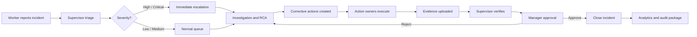

# Business Requirements Document (BRD) — SF-IAMP

**Product:** Smart Factory Incident & Action Management Platform
**Document name:** `brd.md` (puku-suffix)
**Short name:** SF-IAMP
**Version:** 1.0
**Date:** 2026-06-18
**Status:** Draft, build-ready
**Prepared for:** AI-Driven Development Workshop / Smart Factory MVP build
**Primary business domain:** Garment factory operations, quality, safety, maintenance, compliance, and corrective action management

> This BRD is the companion to `prd.md` (also puku-suffix) and the master `spec.md` in the parent `sf-iamp-prd-srs/` directory. It focuses on **business needs, capabilities, stakeholders, KPIs, business rules, and risk**. Functional/technical detail lives in `prd.md` and the parent spec.

---

## 1. Executive Summary

Garment factories handle operational incidents through fragmented tools: WhatsApp for breakdowns, Excel for quality, phone calls for safety, email chains for compliance. This produces poor visibility, weak accountability, delayed escalation, missing evidence, and no trustworthy trend data. The **Smart Factory Incident & Action Management Platform (SF-IAMP)** replaces those tools with one governed workflow for incident reporting, root-cause analysis (RCA), corrective and preventive action (CAPA) management, automated escalation, manager closure approval, analytics, role-based access control (RBAC), an immutable audit trail, and three assistive AI features (Summarizer, Root-Cause Assistant, Corrective-Action Generator).

SF-IAMP is not a ticketing tool. In a factory context, an incident can affect production output, worker safety, product quality, buyer compliance, audit readiness, machine reliability, and management accountability. The core business objective is to convert scattered incident communication into a **governed, auditable, measurable, AI-assisted workflow** from report → investigation → corrective action → verified closure.

The target market-inspired positioning is: **SafetyCulture-style frontline reporting + MaintainX-style action execution + Intelex-style incident lifecycle + VelocityEHS-style AI assistance, simplified for garment factories**.

---

## 2. Business Context

### 2.1 Current-State Pain Points

| Area | Current behavior | Business impact |
|---|---|---|
| Machine breakdowns | WhatsApp groups, calls, verbal updates | Production delays, weak ownership, poor MTTR, repeat breakdowns |
| Quality defects | Excel / informal sheets | No real-time trend view, recurring defects not linked to causes, weak audit evidence |
| Safety incidents | Phone calls, supervisor memory | Delayed escalation, lost near-miss data, incomplete investigation records |
| Compliance findings | Email chains, audit files | Weak closure evidence, hard to prove corrective-action effectiveness |
| Resolution tracking | Depends on follow-up discipline | Overdue actions, unresolved recurring issues, no SLA visibility |
| Analytics | Manually compiled, after the fact | No visibility of hotspots, repeated causes, overdue owners, or improvement trend |

### 2.2 Target-State Capabilities

| Capability | Description | Expected business value |
|---|---|---|
| Digital incident reporting | Workers and supervisors create incidents with category, severity, section, description, and image evidence | Faster capture, standardized evidence, less data loss |
| Root cause workflow | Supervisors investigate, classify root cause, and maintain investigation notes/checklists | Better prevention and fewer repeated incidents |
| Corrective action management | Multiple actions per incident, each with owner, due date, progress, evidence, and verification | Accountability and closure discipline |
| Escalation engine | Configurable rules notify supervisors/managers for critical, overdue, or blocked work | Reduced silent failure and delayed response |
| Analytics dashboard | Live view of open incidents, closure rates, average resolution time, incidents by department/category/severity | Data-driven management and audit readiness |
| RBAC | Worker, Supervisor, Action Owner, Manager, Admin, Auditor permissions | Least-privilege access and clear accountability |
| AI assistance | Summarization, category/severity suggestions, root cause suggestions, corrective action suggestions | Faster documentation and better first-draft decisions |
| Audit trail | Immutable, attributable, timestamped log of every material change | Buyer, RSC, and internal audit readiness |

### 2.3 Domain Context — Bangladesh RMG

The Bangladesh ready-made-garment (RMG) sector is governed by intense external safety scrutiny (post-Rana Plaza) under the **RMG Sustainability Council (RSC)** and buyer (H&M, Inditex, etc.) audits. RSC remediation is a near-perfect domain fit:

- Remediation items move through **In progress → Pending Verification → Verified as fixed**.
- A factory earns recognition when 100% of initial findings are verified as fixed.
- A **"verified as fixed"** percentage is the headline KPI.
- Escalation and the percentage-fixed metric are the same language SF-IAMP speaks.

This validates the design: time-bound actions, a *Pending Verification* state, a closure gate on "verified as fixed", an escalation engine, and a percentage-fixed KPI.

### 2.4 Research-Backed Design Principles

- **Incident investigation (OSHA / HSE / ILO)** must identify underlying/root causes and corrective actions that reduce recurrence — not blame the visible mistake. SF-IAMP therefore **separates immediate correction/containment from root cause and preventive corrective action** and blocks closure without them.
- **Quality / CAPA (ISO 9001 / 8D)** distinguishes **correction** (fix this instance) from **corrective action** (remove the cause) from **preventive action** (stop recurrence elsewhere) and requires **effectiveness verification**. SF-IAMP enforces this CAPA taxonomy and the verification gate.
- **Manufacturing KPIs (ISO 22400)** drive the analytics design: open incident count, average resolution time, overdue corrective actions, closure rate, recurrence rate, MTTR-style metrics.
- **AI governance (NIST AI RMF)** — Trustworthy AI through reliability, safety, security/resilience, accountability/transparency, explainability, privacy, bias management. SF-IAMP AI is **human-reviewed, auditable, and non-authoritative**; it never assigns blame, recommends discipline, or closes incidents.
- **Secure software (OWASP ASVS, NIST SSDF)** and **Privacy (NIST Privacy Framework)** guide the security/privacy baseline.

---

## 3. Business Objectives

| ID | Objective | Target outcome | Measurement |
|---|---|---|---|
| BO-001 | Replace fragmented incident communication with one governed system | ≥90% of reportable incidents entered into SF-IAMP within 3 months of rollout | Incident capture adoption rate |
| BO-002 | Improve resolution visibility | Managers see live open/overdue status by department, severity, owner | Dashboard availability & accuracy |
| BO-003 | Reduce repeated incidents | Root causes and corrective actions captured and reviewed before closure | Recurrence rate by category/section |
| BO-004 | Improve corrective-action accountability | Each action has owner, due date, progress, evidence, verification | % actions completed on time |
| BO-005 | Improve audit readiness | Each closed incident has evidence, history, RCA, actions, closure approval | Audit-package completeness score |
| BO-006 | Speed documentation using AI | AI converts messy reports into structured summaries and action drafts | Avg time to draft incident/action records |
| BO-007 | Maintain safe human oversight of AI | AI recommendations are visible, editable, never auto-final | % AI suggestions reviewed by an authorized user |

---

## 4. Scope

### 4.1 In Scope — Workshop MVP (8 hours)

1. Authentication (seeded users / mock login or role switch).
2. RBAC for Worker, Supervisor, Action Owner, Manager, Admin, Auditor.
3. Factory / department / section / category / severity reference data.
4. Incident creation with image upload.
5. Incident list and detail (case file) page.
6. Incident status workflow Open → Triaged → Under Investigation → Action Planned → Action In Progress → Pending Verification → Pending Closure Approval → Closed (+ Reopened / Archived).
7. Supervisor triage and RCA entry.
8. Corrective action creation, owner assignment, due date, progress, evidence, verification.
9. Escalation rule evaluation for high severity and overdue actions.
10. Notification log or simulated in-app notification panel.
11. Manager approval and closure.
12. Analytics dashboard: open count, closure rate, average resolution time, incidents by department/category/severity, overdue action count.
13. AI Incident Summarizer.
14. AI Root Cause Assistant.
15. AI Corrective Action Generator.
16. Audit history for material changes.
17. README, API docs, seed data, demo script, basic test cases.

### 4.2 In Scope — Production Release (Phase 1 pilot)

1. Multi-factory and (later) multi-tenant structure.
2. Secure identity provider integration (SSO/OIDC, e.g., Microsoft Entra ID).
3. Configurable workflows by incident type.
4. PWA / mobile-friendly reporting; optional offline draft capture and retry.
5. Multi-language UI (English + local language as required).
6. Configurable SLA / escalation rules by category, severity, department, shift, factory.
7. Evidence management with file scanning and retention policy.
8. Notification integrations: email, SMS, Teams/Slack, WhatsApp gateway (if approved).
9. Exportable audit package for buyers, compliance teams, and management reviews.
10. Advanced analytics: recurrence, hotspots, overdue actions by owner, SLA performance, machine downtime, top root causes.
11. AI evaluation, prompt / version logging, human feedback capture, safe-use monitoring.
12. Background escalation job, idempotent notification dispatch, daily digest.

### 4.3 Out of Scope (MVP)

| Item | Rationale |
|---|---|
| Full ERP / MES / CMMS integration | Too large for MVP; API-ready interfaces only |
| Predictive maintenance | Requires historical machine data and sensor integration |
| Automatic disciplinary action | High-risk; inappropriate for AI-assisted safety/quality workflow |
| Automatic incident closure by AI | Closure requires accountable human approval |
| Full regulatory filing automation | Jurisdiction-specific; requires legal validation |
| Native mobile apps | PWA/responsive UI is sufficient initially |
| Complex HR integration (payroll, HR cases) | MVP can use seeded users and roles |

### 4.4 Out of Scope (Phase 2 / Phase 3)

- Multi-factory multi-tenant enterprise setup, advanced BI.
- Full offline sync, native mobile apps.
- ERP/MES/CMMS integrations, IoT/sensor ingestion, predictive maintenance.
- Workflow designer, advanced root-cause libraries, buyer/RSC filing automation.

---

## 5. Stakeholders

| Stakeholder | Interest | Success criterion |
|---|---|---|
| Factory worker / operator | Fast, simple reporting without paperwork | Report incident in under 2 minutes with image |
| Line supervisor | Rapid triage and ownership assignment | New incidents visible and actionable immediately |
| Maintenance team | Machine-breakdown visibility and action assignment | Breakdown actions prioritized and tracked |
| Quality team | Defect trend and recurring-cause visibility | Quality incidents categorized, investigated, closed with evidence |
| Safety / EHS team | Near-miss / injury / hazard capture and corrective actions | Safety incidents cannot disappear in phone calls |
| Compliance / audit team | Evidence, closure history, exportable records | Audit package generated without manual email hunting |
| Factory manager | Operational visibility and accountability | Dashboard shows trends, overdue work, bottlenecks |
| Admin / IT | User/role/config control | System maintainable without developer intervention |
| Buyers / brand auditors | Evidence of control and continuous improvement | Closed findings include root cause, actions, verification, dates |
| AI development team | Safe, useful embedded AI | AI output helpful, logged, human-reviewed |

---

## 6. Personas

### 6.1 Worker / Operator (Rashida)
- Reports incidents from the factory floor.
- May have limited time and variable digital literacy.
- Needs a simple form, image capture, clear submit confirmation, ability to see own reports.
- Should not need to understand full RCA terminology.

### 6.2 Supervisor (Karim)
- Owns triage, initial investigation, root-cause assignment, and action creation.
- Needs filtered queues by section, severity, and status.
- Needs AI assistance for summaries, root causes, checklists, corrective-action drafting.
- Must remain accountable for final classification.

### 6.3 Action Owner (Maintenance / Quality / EHS staff)
- Owns one or more corrective actions.
- Needs a personal action list, progress update, evidence upload, and submit-for-verification flow.

### 6.4 Manager (Tahmina)
- Reviews high-risk, overdue, and closure-ready incidents.
- Needs analytics, approval queue, and evidence review.
- Approves or rejects closure. Uses trends for management review.

### 6.5 Admin (Shahin)
- Manages users, roles, factories, departments, categories, severity, SLA/escalation policies, AI settings.
- Needs full audit and configuration visibility.

### 6.6 Auditor / Compliance (production-optional)
- Read-only access to approved records and export packages.
- Needs evidence, history, action verification, and management approval without editing rights.

---

## 7. Business Capabilities

| ID | Capability | Description | MVP priority |
|---|---|---|---|
| BC-001 | Incident capture | Structured incident creation with images | Must |
| BC-002 | Incident triage | Severity/category/section verification by supervisor | Must |
| BC-003 | Investigation / RCA | Root cause, notes, and checklist | Must |
| BC-004 | Corrective action tracking | Multiple actions per incident, owner/due/progress/evidence/verify | Must |
| BC-005 | Escalation | High-severity and overdue alerts | Must |
| BC-006 | Approval and closure | Manager approval before final close | Must |
| BC-007 | Dashboard analytics | Operational status and trend metrics | Must |
| BC-008 | RBAC | Role-based access and action authorization | Must |
| BC-009 | AI assistance | Summarizer, RCA assistant, action generator | Must |
| BC-010 | Audit trail | Who changed what and when | Must |
| BC-011 | Export / reporting | CSV / audit package | Should |
| BC-012 | Mobile / PWA | Responsive floor reporting | Should |
| BC-013 | Notification integration | Email / SMS / chat | Should |
| BC-014 | Multi-tenant / multi-factory | Isolated factory data and enterprise views | Could / Phase 2 |
| BC-015 | Integration APIs | ERP / MES / CMMS / BI | Could / Phase 2 |

---

## 8. Core Workflows

### 8.1 End-to-End Incident Process

### 8.2 Incident Lifecycle (eight states + branches)

```mermaid
stateDiagram-v2
    [*] --> Open
    Open --> Triaged: Supervisor+ validates category/severity
    Triaged --> Under_Investigation: RCA started
    Under_Investigation --> Action_Planned: Root cause recorded; ≥1 action defined
    Action_Planned --> Action_In_Progress: Action owner accepts/starts
    Action_In_Progress --> Pending_Verification: Owner submits evidence
    Pending_Verification --> Pending_Closure_Approval: Supervisor verifies actions
    Pending_Verification --> Action_In_Progress: Evidence rejected (reason)
    Pending_Closure_Approval --> Closed: Manager approves
    Pending_Closure_Approval --> Under_Investigation: Manager rejects / sends back
    Closed --> Reopened: Authorized reopen (reason)
    Reopened --> Under_Investigation
    Closed --> Archived: Admin archive (reason)
```

### 8.3 Severity Model

| Severity | Definition | Examples | Required response |
|---|---|---|---|
| **Critical** | Injury, fire, major machine failure, regulatory/buyer-critical nonconformity, major production halt | Injury, electrical fire, major compliance finding, unsafe building issue | Immediate supervisor + manager alert; containment required; RCA required; manager closure required |
| **High** | Serious safety hazard, repeated defect, machine downtime affecting line output, major buyer risk | Needle guard missing, repeated oil stain, machine unavailable | Supervisor alert; RCA required; corrective action due soon; manager visibility |
| **Medium** | Localized issue with moderate impact | Minor defect trend, local maintenance issue, near-miss with no injury | Supervisor triage; action required if recurrence likely |
| **Low** | Minor observation, housekeeping issue, low-risk improvement item | Labeling issue, minor housekeeping | Record and assign if needed; batch review acceptable |

### 8.4 Incident Categories (default taxonomy)

| Category | Examples | Default owner group |
|---|---|---|
| Machine breakdown | Sewing machine stopped, compressor issue, cutting machine fault | Maintenance / Supervisor |
| Quality defect | Stitching defect, oil stain, measurement issue, fabric flaw | Quality / Supervisor |
| Safety incident | Injury, near miss, unsafe act/condition, chemical exposure | EHS / Supervisor |
| Compliance finding | Buyer audit finding, documentation gap, policy nonconformity | Compliance / Manager |
| Fire / electrical / building safety | Fire hazard, wiring issue, blocked exit, structural concern | EHS / Maintenance |
| Housekeeping / environment | Obstruction, spill, waste issue, unsafe storage | Supervisor / EHS |
| Worker welfare | Welfare facility concern, harassment channel placeholder, health risk | HR / EHS / Manager |

### 8.5 Root-Cause Analysis Methods

- **5 Whys** — linear cause chain (Toyota Production System origin).
- **Fishbone / Ishikawa** — multi-factor mapping across the 6/7 Ms: **Machine, Method, Material, Manpower, Measurement, Environment, Management/System**.
- **Classification** — quick categorization (Equipment / Process / Training).
- **Freeform** — narrative investigation.

### 8.6 Corrective-Action (CAPA) Taxonomy

- **Containment** — stop the harm now.
- **Correction** — fix this specific instance.
- **Corrective action** — remove the root cause.
- **Preventive action** — stop recurrence elsewhere.
- **Verification** — prove the fix worked (with evidence).

### 8.7 Closure Rules

- Closure is **blocked** until mandatory actions are **Verified**.
- **High/Critical** cannot close without a recorded RCA.
- **High/Critical** cannot close without at least one corrective or preventive action.
- **High/Critical** cannot close without verification evidence.
- **Manager closure approval is required for High/Critical** (and configurable for Medium/Low).
- Closure approval/rejection is logged; rejection reason is mandatory.
- Closed records are read-mostly and auditable.

---

## 9. User Journeys

| Journey | Primary role | Trigger | End state | Business value |
|---|---|---|---|---|
| J-001 Report incident | Worker | Observes breakdown/defect/hazard/finding | Incident Open and supervisor notified | Fast structured capture |
| J-002 Triage incident | Supervisor | New incident in queue | Incident Triaged | Correct category/severity/ownership |
| J-003 Investigate RCA | Supervisor | Incident requires cause analysis | RCA completed | Prevent recurrence |
| J-004 Assign corrective actions | Supervisor | Root cause confirmed | Actions assigned | Accountability |
| J-005 Complete action | Action Owner | Assigned action | Evidence submitted | Execution tracking |
| J-006 Verify action | Supervisor | Action submitted | Action verified/rejected | Quality of closure |
| J-007 Approve closure | Manager | Incident ready to close | Closed or rejected | Management accountability |
| J-008 Configure workflow | Admin | New factory/process/rule | Config active | Operational fit |
| J-009 Audit review | Compliance / Auditor | Buyer / internal audit | Export package | Evidence readiness |

### 9.1 Journey J-001 — Worker Reports a Safety Hazard (with photo and AI summary)

| Step | User action | System behavior | Business rule |
|---|---|---|---|
| 1 | Worker opens mobile/web app and selects "Report Incident" | System shows simple form with category, section, image, description | Worker can create incident only for accessible factory/section |
| 2 | Worker uploads photo of blocked emergency exit | System validates file type/size and stores image | Only safe file types allowed; virus scan in production |
| 3 | Worker enters messy description: "exit blocked by cartons near line 4" | AI drafts clean summary, suggests Safety/High, and notes immediate containment | AI output is suggestion only |
| 4 | Worker accepts or edits summary | System creates Open incident with unique ID | Incident gets timestamp, reporter, section, category, severity |
| 5 | Supervisor receives alert | Notification is logged | High/Critical incidents trigger immediate escalation |
| 6 | Worker views own incident status | System shows timeline and status | Worker sees only own reports unless granted broader role |

### 9.2 Journey J-002 — Supervisor Investigates Quality Defect

| Step | User action | System behavior | Business rule |
|---|---|---|---|
| 1 | Supervisor opens incident queue | System filters incidents by assigned department/section | Supervisor sees all accessible incidents |
| 2 | Supervisor selects "oil stain recurring on line 2" | System shows incident evidence, history, reporter, AI summary | Audit history visible to authorized roles |
| 3 | Supervisor starts RCA | AI suggests likely causes and checklist: machine leakage, handling process, material contamination | Supervisor must confirm, edit, or reject AI suggestions |
| 4 | Supervisor records root cause | Status moves to Action Planned if root cause is saved | High/Critical cannot skip RCA |
| 5 | Supervisor creates multiple corrective actions | System allows owner, due date, type, progress target, evidence requirement | One incident can have multiple actions |
| 6 | Action owners receive tasks | Notifications logged | Due dates must follow severity SLA unless manager override |

### 9.3 Journey J-003 — Action Owner Completes Corrective Action

| Step | User action | System behavior | Business rule |
|---|---|---|---|
| 1 | Action owner opens "My Actions" | System shows due/overdue tasks | Owner sees assigned actions |
| 2 | Owner updates progress to 50% | System stores progress and comment | Progress must be 0–100 |
| 3 | Owner uploads maintenance photo/evidence | System validates and attaches evidence | Evidence required for verification when configured |
| 4 | Owner marks complete | Status becomes Pending Verification | Completed actions require timestamp and evidence if mandatory |
| 5 | Supervisor reviews evidence | Supervisor accepts or rejects action | Rejected action returns to In Progress with reason |

### 9.4 Journey J-004 — Manager Approves Closure

| Step | User action | System behavior | Business rule |
|---|---|---|---|
| 1 | Manager opens approval queue | System shows incidents ready for closure | Only verified incidents appear |
| 2 | Manager reviews incident package | System shows summary, category, severity, RCA, actions, evidence, timeline | Critical/High require RCA and verified actions |
| 3 | Manager approves closure | Status becomes Closed and closure timestamp is saved | Closed records become read-mostly and auditable |
| 4 | Manager rejects closure | Incident returns to Under Investigation or Action In Progress with required comment | Rejection reason is mandatory |

### 9.5 Journey J-005 — Admin Configures Factory Workflow

| Step | User action | System behavior | Business rule |
|---|---|---|---|
| 1 | Admin creates factory/section/department data | System creates reference data | Names must be unique within tenant/factory |
| 2 | Admin configures incident categories/severities | System stores active/inactive categories | Inactive categories remain on historical records |
| 3 | Admin defines escalation rules | System validates thresholds and recipients | Critical escalation must include manager-level recipient |
| 4 | Admin assigns users to roles/sections | System updates permissions and logs audit event | Admin cannot remove last active admin |

### 9.6 Journey J-006 — Compliance Review / Audit Package

| Step | User action | System behavior | Business rule |
|---|---|---|---|
| 1 | Compliance user filters incidents for date range and buyer audit category | System returns matching closed and open records | Export respects RBAC and tenant isolation |
| 2 | User selects "Export audit package" | System generates package with incident details, evidence references, RCA, actions, approvals, timeline | Exported package includes generated timestamp and user ID |
| 3 | Auditor reviews closure evidence | System displays read-only history | Historical audit trail cannot be edited by normal users |

---

## 10. Business Rules

| ID | Rule | Description |
|---|---|---|
| BRULE-001 | Required fields | Every incident must have a category, severity, factory section, description/summary, reporter, and timestamp. |
| BRULE-002 | Evidence | Image evidence is optional for Low incidents but required for High/Critical unless reporter selects a configured exception reason. |
| BRULE-003 | Immediate escalation | High/Critical incidents must trigger immediate supervisor notification and manager visibility. |
| BRULE-004 | Closure prerequisites | High/Critical cannot be closed without confirmed root cause, ≥1 corrective/preventive action, verification evidence, and manager approval. |
| BRULE-005 | Due-date SLA | Corrective-action due dates must not exceed configured SLA unless an authorized manager records an override reason. |
| BRULE-006 | Completion prerequisites | An action cannot be marked complete without owner, due date, completion timestamp, and required evidence. |
| BRULE-007 | Pending closure gate | Incidents cannot move to Pending Closure Approval until all mandatory actions are verified. |
| BRULE-008 | Reopen | Closed incidents can be reopened only by Manager/Admin with a recorded reason. |
| BRULE-009 | RBAC scope | Workers view own submitted incidents; Supervisors view incidents for assigned areas; Managers view all incidents in assigned factory; Admins have full access within tenant. |
| BRULE-010 | AI labeling | AI output must be marked as AI-generated until reviewed and accepted/edited by a human user. |
| BRULE-011 | AI guardrails | AI must not assign individual blame, make employment/disciplinary recommendations, or close incidents automatically. |
| BRULE-012 | Audit log | All status changes, severity changes, category changes, RCA updates, action changes, approvals, and configuration changes must create audit log entries. |
| BRULE-013 | No delete | Deleting incidents is prohibited for normal users; Admin may archive erroneous duplicates with a reason. |
| BRULE-014 | Historical references | Inactive categories and users remain visible on historical records. |
| BRULE-015 | Overdue recalculation | Overdue actions are recalculated at least hourly in production; on-demand in MVP. |
| BRULE-016 | Duplicate detection | Duplicate detection may suggest related incidents but cannot automatically merge records. |
| BRULE-017 | Retention | Safety-related incident data must be retained per local policy; default recommendation ≥5 years unless jurisdiction requires more. |
| BRULE-018 | PII minimization | Personal and sensitive data must be minimized in AI prompts; image contents must not be sent to external AI unless approved by configuration and policy. |

---

## 11. Business KPIs and Reporting

| KPI | Definition | Formula / source | Target / use |
|---|---|---|---|
| Open incident count | Number of incidents not Closed/Archived | Count by status | Daily operational control |
| High/Critical open count | Severe incidents still active | Count severity in active statuses | Management attention |
| Average acknowledgement time | Avg time from incident creation to first supervisor action | avg(ack_at - created_at) | Triage speed |
| Average resolution time | Avg time from incident creation to closure | avg(closed_at - created_at) | Trend improvement |
| Closure rate | Closed incidents / total incidents in period | closed / created | Operational throughput |
| Overdue action count | Actions past due and not complete/verified | Count actions where due_date < now | Accountability |
| On-time action completion | Actions completed by due date / completed actions | completed_on_time / completed | SLA compliance |
| Recurrence rate | Incidents with same category/root cause/section recurring in period | Configurable matching rule | Prevention effectiveness |
| Incident heatmap | Count by section/category/severity | Aggregation | Hotspot detection |
| RCA completion rate | Incidents requiring RCA that have RCA completed | RCA completed / RCA required | Investigation discipline |
| AI acceptance rate | AI suggestions accepted or edited into final record | accepted AI outputs / generated outputs | AI utility monitoring |
| Reopened incident rate | Closed incidents reopened | reopened / closed | Closure quality |
| Audit package completeness | Required fields/evidence present | Checklist score | Compliance readiness |

---

## 12. MVP Success Criteria

| Area | Success criterion |
|---|---|
| Working features | End-to-end report → RCA → corrective actions → escalation → manager closure → dashboard works with seeded data |
| AI usage | At least three AI features work with logging and human acceptance controls |
| Requirement quality | BRD / PRD / SRS / user journeys traceable to implemented user stories |
| Architecture | Backend, frontend, database, auth, and AI integration are documented |
| Test coverage | Key flows have unit / API / E2E tests or executable test cases |
| Documentation | README, setup, API docs, seed users, demo script are present |
| Demo quality | Demo tells a realistic garment-factory story with before/after impact |

---

## 13. Risks and Mitigations

| Risk | Impact | Mitigation |
|---|---|---|
| Workers avoid reporting due to blame culture | Underreporting, weak data | Allow simple reporting, clear non-punitive policy, optional anonymous mode in Phase 2 |
| AI suggestions treated as authoritative | Bad RCA/actions or unfair blame | Human review required; AI confidence/explanation; no disciplinary recommendations |
| Poor category/severity setup | Bad analytics and escalation noise | Admin-managed taxonomy; periodic review; configurable mappings |
| Uploaded images contain sensitive information | Privacy/security exposure | Access control, retention policy, secure storage, masking guidance, approved AI/image handling |
| Escalation fatigue | Users ignore notifications | Severity-based thresholds, digest options, escalation tuning |
| Incomplete action evidence | Weak audit readiness | Mandatory evidence rules by category/severity |
| Slow shop-floor UX | Low adoption | Mobile-first/PWA, minimal required fields, offline drafts in Phase 2 |
| Data isolation failure in multi-tenant mode | Serious confidentiality issue | Tenant-scoped authorization tests, DB constraints, security review |
| Workshop team overbuilds | Missed MVP | Strict MVP cut; defer integrations and advanced analytics |
| AI provider unavailable | Manual workflow stalls | Graceful degradation; mock AI in MVP; cached/stubbed responses |
| Photo of injured worker uploaded | Privacy / consent issue | Image consent banner, access controls, retention limits, masking workflow |
| Severities downgraded to bypass closure | Audit integrity loss | Reason mandatory; only manager override allowed; audit event |

---

## 14. Assumptions

1. Initial workshop data can be seeded rather than integrated from production HR/ERP systems.
2. MVP users are internal factory users, not external buyers.
3. MVP can simulate notifications through an in-app notification table/panel.
4. Image upload can be local or S3-compatible storage depending on chosen stack.
5. AI integration can be mocked or live, but output must be logged and visibly marked.
6. Legal/regulatory reporting requirements vary by jurisdiction; this BRD defines product workflow, not legal compliance advice.
7. Factories may have limited shop-floor devices; UI must work on low-to-mid-range phones and shared desktops.
8. English is the primary UI language for MVP; localization to local languages is a Phase 1 item.

---

## 15. Dependencies

| Dependency | Description | MVP handling |
|---|---|---|
| Authentication | User identity and role assignment | Seeded users or simple login acceptable |
| AI model/provider | Summaries / RCA / action suggestions | Configurable provider or mock service |
| File storage | Image/evidence upload | Local storage or object-storage adapter |
| Notification channel | Alerts and escalations | In-app notifications in MVP |
| Database | Incidents, actions, audit, users, config | PostgreSQL preferred; SQLite acceptable for demo only |
| Deployment | Demo environment | Docker Compose recommended |

---

## 16. Phase Roadmap

| Phase | Goal | Features |
|---|---|---|
| Phase 0 — Workshop MVP (8h) | Demonstrate core value | Incident CRUD, RBAC, RCA, actions, escalation, dashboard, AI helpers |
| Phase 1 — Pilot (one factory) | Production-grade use | Strong auth, production DB, PWA, email notifications, audit export, backup |
| Phase 2 — Multi-factory | Enterprise rollout | Tenant isolation, factory hierarchy, configurable workflows, advanced dashboards |
| Phase 3 — Integrated smart factory | Integration with operations | ERP/MES/CMMS hooks, IoT-triggered incidents, predictive maintenance, BI warehouse |
| Phase 4 — Continuous improvement | Optimize outcomes | Recurrence analytics, root-cause libraries, AI feedback loop, management review packs |

---

## 17. Approval Criteria for Business Stakeholders

The product is business-acceptable when:

1. A Worker can report an incident with a photo and section in under 2 minutes.
2. A Supervisor can triage, record RCA, and create multiple corrective actions.
3. An Action Owner can update progress, upload evidence, and submit for verification.
4. A Supervisor can verify or reject completed actions with reason.
5. A Manager can approve or reject closure with full context.
6. An Admin can configure users, roles, categories, severities, and escalation rules.
7. Dashboards show live operational metrics and are explainable.
8. Overdue and high-severity items are visible without manual chasing.
9. Closed incidents contain enough evidence for audit review.
10. AI suggestions are useful but never replace human accountability.

---

## 18. Glossary

| Term | Meaning |
|---|---|
| RMG | Ready-made garment (industry segment) |
| RSC | RMG Sustainability Council — Bangladesh factory-safety monitor |
| EHS | Environment, Health & Safety |
| CAPA | Corrective And Preventive Action |
| RCA | Root-Cause Analysis |
| MTTR | Mean Time To Repair/Resolve |
| SLA | Service-Level Agreement (acknowledge / resolve targets) |
| PII | Personally Identifiable Information |
| PWA | Progressive Web App |
| NIST AI RMF | NIST AI Risk Management Framework |
| OWASP ASVS | OWASP Application Security Verification Standard |
| ISO 22400 | KPI framework for manufacturing operations management |
| ISO 45001 | Occupational Health & Safety management |
| 8D | Eight-Discipline Problem-Solving method (D1–D8) |

---

## 19. Cross-References

- **Companion document** — `prd.md` (this directory) for functional/non-functional requirements, data model, AI governance, traceability, and acceptance criteria.
- **Master spec** — `../sf-iamp-prd-srs/spec.md` for the canonical 40-section spec at higher engineering detail.
- **Source research** — `../../docs/SF-IAMP-Research-Dossier.md`, `../../docs/SF-IAMP-SRS.md`, `../../docs/Smart_Factory_Incident_Action_Platform_Combined_BRD_SRS.md`, `../../docs/SMART_FACTORY_IAMP_MARKET_RESEARCH_REQUIREMENTS_FEATURES.md`, `../../docs/AI_Driven_Dev_Workshop.pdf`.

*— end of BRD (puku-suffix) —*
