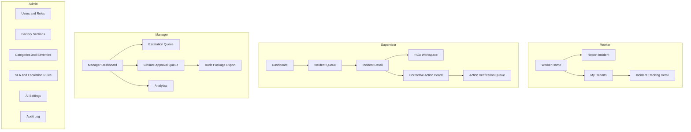
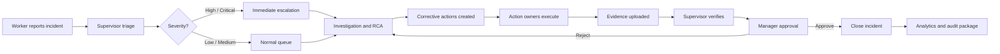
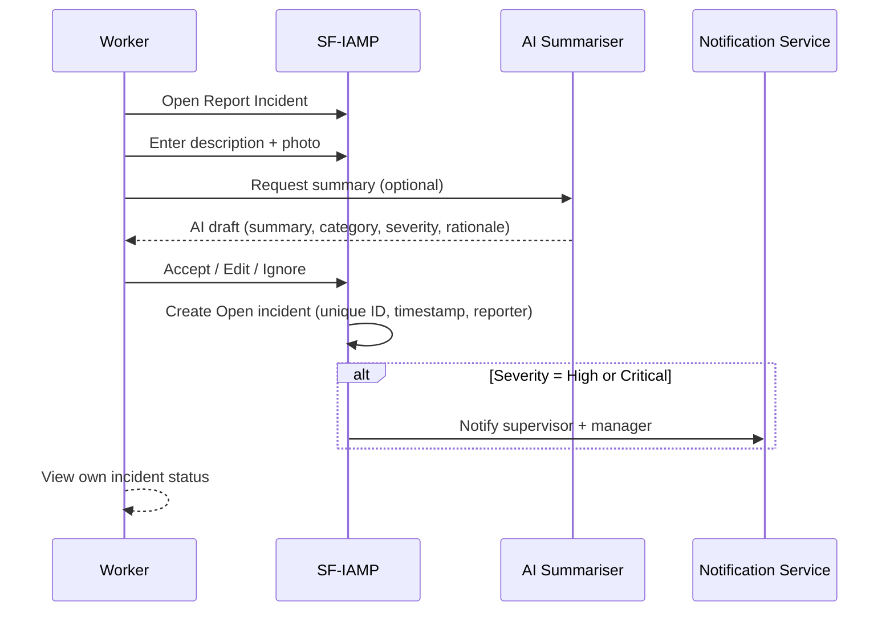
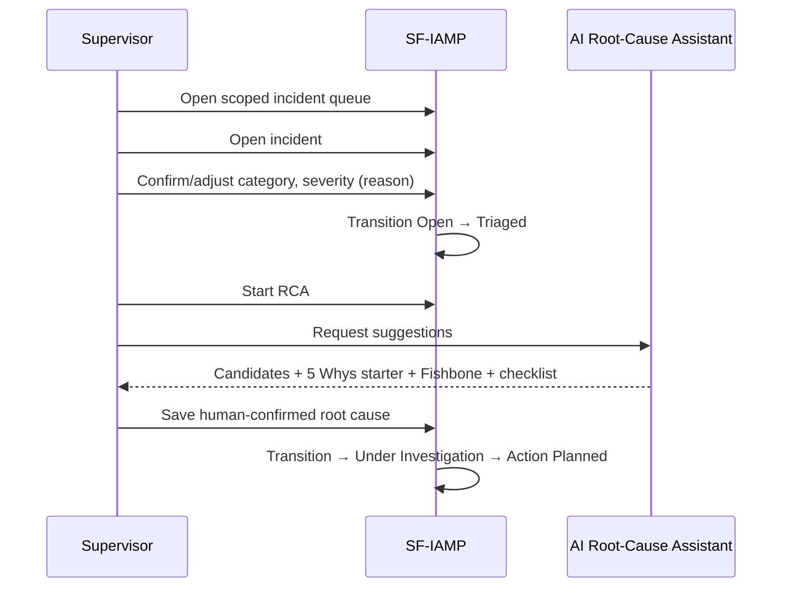
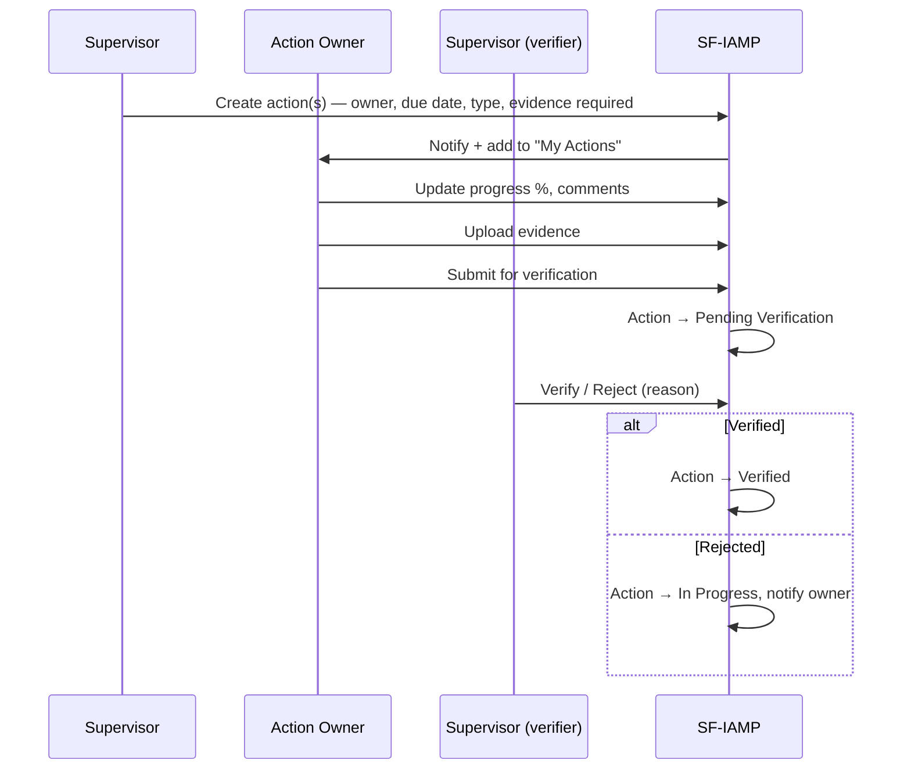
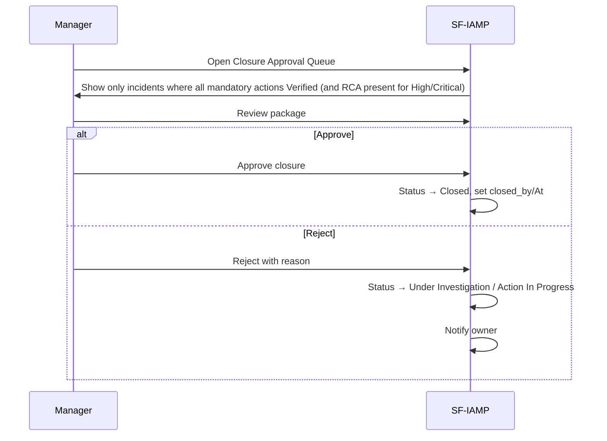
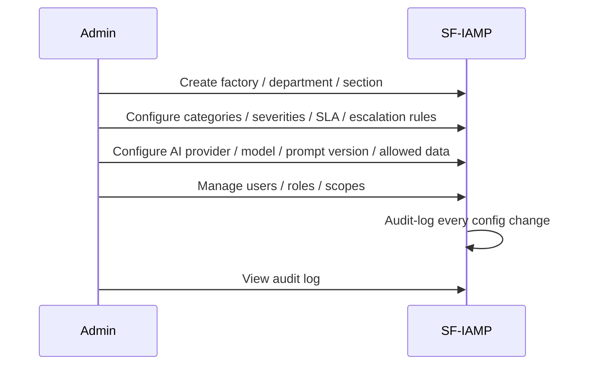
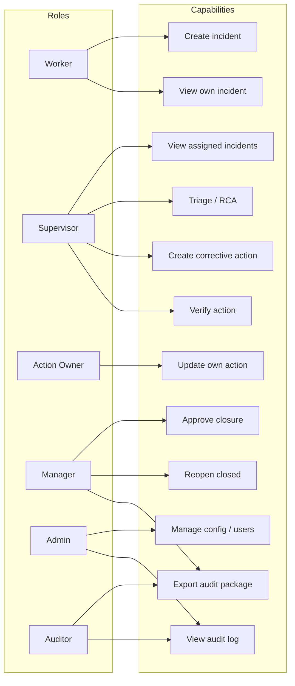
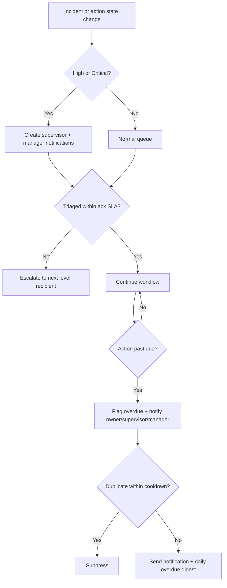
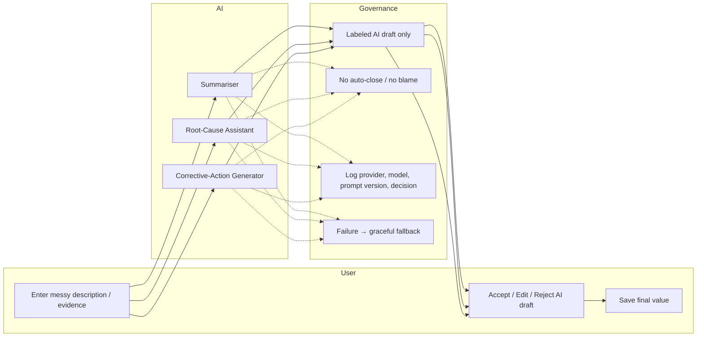

# Product Requirements Document (PRD) — SF-IAMP

**Product:** Smart Factory Incident & Action Management Platform
**Document name:** `prd.md` (puku-suffix)
**Short name:** SF-IAMP
**Version:** 1.0
**Date:** 2026-06-18
**Status:** Draft, build-ready
**Prepared for:** AI-Driven Development Workshop / Smart Factory MVP build
**Companion documents:** `brd.md` (this directory), master `../sf-iamp-prd-srs/spec.md`

> This PRD is the **functional and product-behavior** layer. The `brd.md` companion covers business needs, capabilities, KPIs, business rules, and risk. The master `spec.md` adds SRS-style depth, the data model, API expectations, and traceability. This PRD is the bridge between business intent and engineering requirements: detailed enough that an engineer, AI engineer, QA engineer, or architect can implement the MVP without verbal clarification.

---

## 1. Executive Summary

The Smart Factory Incident & Action Management Platform (SF-IAMP) is a web/PWA-style application for garment factory incident and corrective action management. Users report incidents, supervisors investigate root causes, action owners execute corrective actions, managers approve closure, and admins configure the system. Three assistive AI features (Summarizer, Root-Cause Assistant, Corrective-Action Generator) accelerate documentation under strict human-in-the-loop governance.

This PRD is closer to a comprehensive SRS than a lightweight product brief. It is intended for product owners, software engineers, AI engineers, QA engineers, architects, and workshop teams. It is detailed enough that another agent or developer can implement the MVP without verbal clarification, and it is directly usable by the next Spec Kit phases (`/speckit-clarify`, `/speckit-plan`, `/speckit-tasks`, `/speckit-implement`).

The MVP must be buildable in 8 workshop hours by a small team using mock login/role switch, in-memory or SQLite storage, local file uploads, and a mocked AI service. Production-grade hardening (SSO, PostgreSQL, real AI provider with prompt versioning, object storage, email/SMS, RBAC tests, backup, observability) follows as a Phase 1 pilot.

---

## 2. Product Vision

Create a simple, reliable, AI-assisted platform that gives garment factory teams one shared system to **report incidents, investigate root causes, assign corrective actions, escalate overdue work, and prove closure with evidence** — and replace WhatsApp/Excel/phone/email fragmentation with a governed workflow.

### 2.1 Product Goals

| Goal | Description | Metric |
|---|---|---|
| Reduce reporting friction | Workers can report incidents quickly | Incident submission ≤ 60 seconds for basic report |
| Improve accountability | Every incident has visible owner/status/action | ≥ 95% incidents have owner/action when required |
| Improve closure discipline | High-risk incidents cannot close without verification | 100% High/Critical closures have evidence and approval |
| Improve visibility | Managers see live status and trends | Dashboard loads key metrics in ≤ 3 seconds |
| Demonstrate AI value | AI helps structure messy input and action planning | AI summary / RCA / action suggestions available in demo |
| Keep MVP buildable | Build in workshop timeline | Core flow completed in 8 hours |
| Make audit defensible | Every change is attributable and exportable | 100% material changes captured in audit log |

### 2.2 Product Non-Goals

- Full ISO 45001 certification system.
- Full EHS regulatory reporting suite.
- ERP integration.
- IoT sensor integration.
- Biometric worker tracking.
- Predictive maintenance model.
- Complex multi-tenant SaaS billing.
- Advanced offline sync.
- Full mobile-native app.
- Full workflow designer.

---

## 3. Problem Statement

Garment factories track machine breakdowns in WhatsApp, quality issues in Excel, safety incidents via phone calls, and compliance findings in email chains. The consequences are:

- **Poor resolution visibility** — managers do not know which incidents are open, overdue, or stuck.
- **Weak accountability** — actions have no owner, no due date, no progress, no evidence.
- **Delayed escalation** — High/Critical events take hours to reach the right person.
- **Missing evidence** — photos and notes are lost in chat threads.
- **Lost compliance history** — buyers and RSC cannot retrieve closure evidence on demand.
- **No trustworthy analytics** — no live picture of hotspots, trends, or recurring causes.
- **AI under-used** — workers and supervisors type messy free text and build CAPA lists by hand.

The target product replaces that fragmented process with **one governed workflow** for incident reporting, triage, root-cause analysis, corrective action tracking, escalation, verification, closure approval, audit trail, analytics, and assistive AI.

---

## 4. Business Context

See `brd.md` §2 for the full business context (current-state pain, target-state capabilities, Bangladesh RMG / RSC domain context, research-backed design principles). In short: SF-IAMP sits at the intersection of EHS incident management, CAPA / QMS corrective action, CMMS work-order execution, mobile inspection, and AI-assisted operational risk.

---

## 5. Market Research Summary

The market validates the design across four pillars:

| Pillar | What the market says | SF-IAMP implication |
|---|---|---|
| EHS / incident platforms (Intelex, Cority, VelocityEHS, SpheraCloud, EHS Insight, Ecesis, SafetyCulture) | Common spine: mobile capture with photos → triage → RCA → CAPA → dashboard; AI is the 2025-26 frontier | Build the same spine; differentiate on Bangladesh RMG fit and governed AI |
| CAPA / QMS (MasterControl, isoTracker, 6sigma, FDA Group, Aligni) | Closure gated on **verified effectiveness**; immediate correction ≠ corrective action ≠ preventive action | Implement the CAPA taxonomy and verification gate exactly as defined |
| RCA methods (5 Whys, Fishbone / Ishikawa) | Two dominant techniques, often used together (Fishbone to map, 5 Whys to drill) | Support both natively; allow Classification and Freeform too |
| AI governance (NIST AI RMF) | Trustworthy AI requires human oversight, accountability, documentation, logging of decisions | Label every AI output as a draft; log provider/model/prompt-version; never auto-close; never blame |

A separate `../../docs/SMART_FACTORY_IAMP_MARKET_RESEARCH_REQUIREMENTS_FEATURES.md` contains the full feature comparison and `../../docs/SF-IAMP-Research-Dossier.md` contains the full research dossier with sources.

---

## 6. Competitor / Inspiration Analysis

| Inspiration | What we copy | What we do not copy |
|---|---|---|
| **SafetyCulture** | Mobile-first reporting, large "Report Incident" button, issue cards, action list with owner/due/status, dashboard cards | Full inspection template complexity; enterprise module sprawl |
| **Intelex** | Incident case-file layout, structured investigation tabs, RCA + actions in same case, manager approval before closure, audit-ready history | Dense enterprise forms; full OSHA/regulatory forms in MVP |
| **Cority** | End-to-end lifecycle, dashboard filters by department/section/severity/status/date, root cause and action status as first-class reporting dimensions | Heavy enterprise depth |
| **VelocityEHS** | AI assistant as contextual panel; AI corrective-action suggestions tied to hazard/root-cause; Accept/Edit/Reject workflow; auditable and human-reviewed AI | AI that decides outcomes; AI that closes incidents |
| **SpheraCloud** | Manager dashboard density; one central application for safety information | Broad enterprise suite depth; heavy navigation |
| **MaintainX** | Action board as work-order workflow; "start work / update progress / upload evidence / mark complete" simplicity; due date, priority, owner, comments, evidence on every action; completion percentage | Full CMMS asset hierarchy in MVP |
| **GoAudits** | Fast worker/supervisor capture, photo evidence in report, simple PDF/export for audit package, corrective actions from failed findings | Heavy PDF templating |
| **MasterControl CAPA** | Action completed ≠ incident closed; closure requires verification/effectiveness review; separate immediate correction, corrective action, preventive action | Heavy regulated-industry form discipline |
| **isoTracker** | Guided RCA tools, effectiveness check before closure, automatic reminders and escalation | Lightweight-ness is acceptable; not the depth |

---

## 7. Target Users and Personas

See `brd.md` §6 for the full persona descriptions (Rashida the Worker, Karim the Supervisor, the Action Owner persona, Tahmina the Manager, Shahin the Admin, and the Auditor/Compliance persona).

---

## 8. Stakeholders

See `brd.md` §5 for the full stakeholder table and success criteria.

---

## 9. Goals and Non-Goals

### 9.1 Goals (in priority order)

1. Demonstrable end-to-end MVP in 8 hours (Open → Triaged → Under Investigation → Action Planned → Action In Progress → Pending Verification → Pending Closure Approval → Closed).
2. RBAC enforced server-side for six roles.
3. Mobile-first worker reporting with image upload and optional AI summary.
4. Supervisor triage, RCA, corrective action creation and verification.
5. Action owner progress, evidence, and submit-for-verification.
6. Manager closure approval with reason and audit.
7. Analytics dashboard with five KPIs and at least three breakdowns.
8. Audit timeline on the incident detail page.
9. AI: summarizer, RCA assistant, corrective action generator, all human-reviewed.
10. Seed data, demo script, README, API docs, basic tests.
11. Manual workflow continues to work when AI fails.

### 9.2 Non-Goals (MVP)

- Full multi-factory / multi-tenant enterprise setup.
- Full offline sync.
- Native mobile apps.
- ERP / MES / CMMS / BI integration.
- IoT / sensor ingestion; predictive maintenance.
- Workflow designer.
- AI that auto-closes incidents.
- AI that names individuals or recommends discipline.
- SSO/IdP integration (acceptable to defer behind mock login).
- Real email/SMS channels (acceptable to defer behind in-app notification panel).

---

## 10. MVP Scope

### 10.1 P0 — Must for the 8-hour workshop MVP

| Capability | Notes |
|---|---|
| Mock login / role switch | Worker, Supervisor, Action Owner, Manager, Admin, Auditor |
| Incident creation with image upload | Required fields: category, severity, factory section, description; image evidence; reporter + timestamp + unique ID |
| Incident queue | Filter by status, severity, category, section, owner, date range, overdue |
| Incident detail (case file) | Summary, raw description, AI summary, evidence, RCA, actions, timeline, audit |
| Status workflow | Eight states + Reopened + Archived; transition guards |
| Triage | Supervisor confirms / adjusts category, severity, section; reason required for downgrade |
| RCA | Method (5 Whys / Fishbone / Classification / Freeform) + root-cause category + statement + notes |
| AI Incident Summarizer | Clean summary, suggested category, suggested severity, rationale, missing-info questions, immediate containment suggestion |
| AI Root Cause Assistant | Possible causes, 5 Whys starter, Fishbone suggestions, investigation checklist |
| AI Corrective Action Generator | Containment, correction, corrective, preventive actions with role suggestion and suggested due date |
| Corrective actions | Multiple per incident; owner, due date, type, priority, status, progress %, evidence requirement, verification |
| Closure approval | Manager only; blocked if RCA / actions / evidence missing for High/Critical; reason for rejection |
| Escalation flags | High/Critical creation, overdue actions; basic notification log |
| Manager dashboard | Open count, High/Critical open, overdue actions, closure rate, average resolution time, breakdowns |
| RBAC basics | Server-side enforcement; UI hides unauthorized actions |
| Audit timeline | Append-only, attributable, timestamped |
| Mock AI service | Deterministic, no live LLM call required |
| Seed data + demo script | Realistic garment-factory story |

### 10.2 P1 — Should for a polished pilot

| Capability | Notes |
|---|---|
| Export audit package | JSON / PDF with summary, RCA, actions, evidence list, approvals, timeline; respects RBAC |
| Admin configuration UI | Users/roles, sections, categories, severities, SLAs, escalation rules, AI settings |
| Real notification integrations | Email (SMTP / transactional), SMS gateway, Teams/Slack, WhatsApp gateway |
| Better analytics filters | Date range, factory, section, owner, category, severity, status |
| Real AI provider with prompt versioning | Provider-agnostic; env-driven; prompt registry; full AI log |
| File scanning (antivirus / MIME sniff) | ClamAV or equivalent; reject / quarantine on hit |
| PWA improvements | Service worker, installable, basic offline draft |

### 10.3 P2 — Later (post-pilot)

- Multi-factory / multi-tenant enterprise setup.
- Full offline sync (CRDT / queue / conflict resolution).
- Native mobile apps (iOS / Android).
- ERP / MES / CMMS / BI integration (outbound webhooks, OAuth2).
- IoT / sensor ingestion (MQTT, OPC-UA, downtime events).
- Predictive maintenance.
- Advanced BI (drill-down, recurrence heatmaps, root-cause libraries).
- Workflow designer (custom statuses, custom fields).

---

## 11. Production Scope

See `brd.md` §4.2 for the full production (Phase 1 pilot) scope. The PRD's normative functional and non-functional requirements in §23 and §24 already describe the production-grade targets, distinguishing Must / Should / Could.

---

## 12. Out of Scope

See `brd.md` §4.3 (MVP) and §4.4 (post-pilot). The product will explicitly **not** include AI that auto-closes incidents, AI that assigns blame to named individuals, or AI that recommends discipline — these are governance guardrails, not exclusions of convenience.

---

## 13. Success Metrics and KPIs

See `brd.md` §11 for the full KPI table. The MVP must at minimum expose:

- Open incident count
- High/Critical open count
- Overdue action count
- Closure rate
- Average resolution time
- Average acknowledgement time
- Incidents by department
- Incidents by category
- Incidents by severity
- Incidents by status
- Corrective actions by owner/status
- RCA completion rate
- AI suggestion acceptance / edit / rejection rate
- Reopened incident count
- Verification rejection count

Workshop scoring (from `AI_Driven_Dev_Workshop.pdf`): Working Features 25%, AI Usage 20%, Requirement Quality 15%, Architecture 15%, Test Coverage 10%, Documentation 10%, Demo Quality 5%.

---

## 14. User Roles and Permissions

The product defines six roles. The full permission matrix is in [§19 Role-Based Permission Model](#19-role-based-permission-model) below.

| Role | Primary capability |
|---|---|
| **Worker** | Create incident, attach evidence, use/ignore AI summary, view own incidents and statuses |
| **Supervisor** | Triage, RCA, create corrective actions, assign owners/due dates, verify / reject action evidence |
| **Action Owner** | View assigned actions, update progress, comment, upload evidence, submit for verification |
| **Manager** | View all factory incidents, view analytics, view escalated/overdue, approve / reject closure, reopen, export audit package |
| **Admin** | Manage users / roles, configure factories / departments / sections / categories / severities / SLA / escalation / AI settings, view audit log |
| **Auditor / Compliance** | Read-only access to assigned audit scope; export audit package |

---

## 15. Role-Based Information Architecture




### 15.1 Page Inventory (normative)

| Page | Route | Roles | Core elements |
|---|---|---|---|
| Login / Role Switch | `/login` | All | Username/password (or role switch in MVP) |
| Worker Home | `/my` | Worker | Report button, own incidents, notification cards |
| Report Incident | `/incidents/new` | Worker+ | Section, category, severity, description, image, AI summary panel |
| My Reports | `/my/incidents` | Worker | Own list, status, last update |
| Incident Tracking Detail | `/incidents/:id` (worker subset) | Worker | Status, timeline, status history |
| Dashboard (Supervisor) | `/dashboard` | Supervisor+ | KPI cards, queue, recent activity |
| Incident Queue | `/incidents` | Supervisor+ | Filters, table/cards, status/severity badges, overdue flags |
| Incident Detail (case file) | `/incidents/:id` | Supervisor+ | Summary, evidence, RCA, actions, timeline, audit |
| RCA Workspace | `/incidents/:id/rca` | Supervisor+ | Method picker, AI suggestions, checklist, RCA form |
| Corrective Action Board | `/actions` | Supervisor+ | Cards/list by status, owner, due date, completion |
| Action Verification Queue | `/actions/verify` | Supervisor+ | Submitted actions, evidence, accept/reject |
| Manager Dashboard | `/manager` | Manager+ | KPIs, escalations, approvals |
| Escalation Queue | `/escalations` | Manager+ | High/Critical, overdue, blocked |
| Closure Approval Queue | `/approvals` | Manager+ | Pending closure items, evidence, approve/reject |
| Analytics | `/analytics` | Manager+ | Charts, filters, drill-down |
| Audit Package Export | `/incidents/:id/export` | Manager+ | Configurable package, generated_by/At |
| Admin · Users & Roles | `/admin/users` | Admin | User CRUD, roles, scopes |
| Admin · Factory Sections | `/admin/sections` | Admin | Factory / department / section CRUD |
| Admin · Categories & Severities | `/admin/taxonomy` | Admin | Category, severity, root-cause category, action type |
| Admin · SLA & Escalation Rules | `/admin/rules` | Admin | Rules, recipients, cooldowns, channels |
| Admin · AI Settings | `/admin/ai` | Admin | Provider, model, prompt versions, allowed data |
| Admin · Audit Log | `/admin/audit` | Admin | Search, filter, export |
| Auditor View | `/audit` | Auditor | Read-only scope, export |

---

## 16. User Journeys

See `brd.md` §9 for the full journey list and the detailed step-by-step maps. The journeys are independently testable:

- **J-001 Worker Reports Incident** (P1)
- **J-002 Supervisor Triages** (P1)
- **J-003 Supervisor Performs RCA** (P1)
- **J-004 Supervisor Creates Corrective Actions** (P1)
- **J-005 Action Owner Completes Action** (P1)
- **J-006 Supervisor Verifies Action Evidence** (P1)
- **J-007 Manager Approves/Rejects Closure** (P1)
- **J-008 Admin Configures Workflow** (P2)
- **J-009 Auditor Exports Audit Package** (P2)

---

## 17. Core Workflows

### 17.1 End-to-End Incident Process



### 17.2 Worker Incident Reporting Journey



### 17.3 Supervisor Triage and RCA Journey



### 17.4 Corrective Action Execution and Verification Journey



### 17.5 Manager Closure Approval Journey



### 17.6 Admin Configuration Journey



---

## 18. Incident Lifecycle

See [§5](#5-incident-lifecycle) in `brd.md` for the lifecycle diagrams and transition table. The eight tracked states and the branch states are normative; transitions are enforced by the server and recorded in the audit log.

---

## 19. Role-Based Permission Model



### 19.1 Permission Matrix (normative)

| Capability | Worker | Supervisor | Action Owner | Manager | Admin | Auditor |
|---|:--:|:--:|:--:|:--:|:--:|:--:|
| Create own incident | ✓ | ✓ | ✓ | ✓ | ✓ | — |
| View own incident | ✓ | ✓ | ✓ | ✓ | ✓ | ✓ (read) |
| View all incidents in assigned scope | — | ✓ | — | ✓ | ✓ | ✓ (read) |
| View assigned actions | — | ✓ | ✓ | ✓ | ✓ | ✓ (read) |
| Edit category/severity/section | — | ✓ (reason) | — | ✓ (reason) | ✓ | — |
| Add RCA | — | ✓ | — | ✓ | ✓ | — |
| Create corrective action | — | ✓ | — | ✓ | ✓ | — |
| Update assigned action | — | ✓ | ✓ | ✓ | ✓ | — |
| Verify action | — | ✓ | — | ✓ | ✓ | — |
| Approve / reject closure | — | — | — | ✓ | ✓ | — |
| Reopen closed | — | — | — | ✓ (reason) | ✓ (reason) | — |
| Export records | — | — | — | ✓ | ✓ | ✓ (read) |
| Configure users / categories / rules | — | — | — | — | ✓ | — |
| View audit log | — | ✓ (own section) | — | ✓ | ✓ | ✓ (read) |
| Manage AI settings | — | — | — | — | ✓ | — |

---

## 20. Severity Model and Escalation Matrix

See [§6](#6-severity--escalation-model) in `brd.md` for the matrix and escalation logic. The diagram is included below for completeness.




---

## 21. Root-Cause Analysis Requirements

See [§7](#7-root-cause-analysis-model) in `brd.md` for the methods. The image and normative requirements are below.


- Methods: **5 Whys**, **Fishbone / Ishikawa** (Machine, Method, Material, Manpower, Measurement, Environment, Management/System), **Classification**, **Freeform**.
- High/Critical require recorded RCA before closure.
- The confirmed root cause must be categorized from a controlled vocabulary.
- The AI Root-Cause Assistant must not name individuals or recommend discipline; the supervisor must Accept / Edit / Reject.

---

## 22. CAPA / Corrective Action Taxonomy


Action types: **Containment, Correction, Corrective, Preventive, Verification**. The closure loop is normative. The lifecycle of a single action is `Not Started → In Progress → Pending Verification → Verified` with branch states `Rejected` (returns to In Progress) and `Cancelled`. See [§8](#8-corrective-action-capa-model) in `brd.md` for the lifecycle and rules.

---

## 23. AI Assistance and Human-in-the-Loop Governance




### 23.1 AI Governance Requirements (normative)

| ID | Priority | Requirement |
|---|---|---|
| AI-G-001 | Must | Every AI output is visibly labeled as a non-authoritative draft; nothing persists until a person confirms. |
| AI-G-002 | Must | A human reviewer Accepts / Edits / Rejects / Ignores every output, gated by role. |
| AI-G-003 | Must | AI never auto-closes, auto-approves, or auto-assigns an incident or action. |
| AI-G-004 | Must | AI never names blameworthy individuals or recommends discipline; prefers role-based responsibility. |
| AI-G-005 | Must | Every suggestion + decision is logged with provider, model, prompt version, input reference, output, reviewer, decision, timestamp. |
| AI-G-006 | Must | AI failure does not block the manual workflow. |
| AI-G-007 | Must | AI prompts use minimum-necessary data; image content is not sent to external AI unless explicitly enabled. |
| AI-G-008 | Must | AI treats user-supplied descriptions as untrusted content (prompt-injection resistance). |
| AI-G-009 | Should | AI suggestions for safety-critical incidents require stronger human verification. |
| AI-G-010 | Should | AI logging cannot be disabled by configuration. |
| AI-G-011 | Should | AI features are evaluated against representative examples before pilot rollout. |

---

## 24. Functional Requirements

This section enumerates the **normative** functional requirements. Every requirement follows the **structured requirement format**: ID, Title, Priority, Description, Actor, Preconditions, Main flow, Exceptions, Acceptance criteria, Related user journey, Related data entities.

### 24.1 Authentication, Session, and RBAC (FR-AUTH)

#### FR-AUTH-001 — Mock login / role switch (Must)
- **Description**: The system shall allow users to log in via seeded credentials or a clearly-labelled mock role switch.
- **Actor**: All roles.
- **Preconditions**: Seed data is loaded.
- **Main flow**: User picks a role or signs in; session is created.
- **Exceptions**: Invalid credentials fail safely with a generic error.
- **Acceptance**: Valid credentials create a session; invalid fail safely. Mock role switch is clearly labelled "Demo".
- **Journey**: J-001 … J-008.
- **Entities**: User, Role, UserRole.

#### FR-AUTH-002 — Role assignment (Must)
- **Description**: Each user shall have one or more roles: Worker, Supervisor, Manager, Admin, Action Owner (capability), Auditor.
- **Actor**: Admin assigns; System enforces.
- **Acceptance**: Role appears in session claims and is honoured in permission checks.

#### FR-AUTH-003 — Server-side RBAC on every endpoint (Must)
- **Description**: Every API endpoint and UI action shall be authorized server-side.
- **Acceptance**: Unauthorized calls return 403; UI hides unavailable actions.

#### FR-AUTH-004 — Worker scope (Must)
- **Description**: Workers shall only see incidents they reported (or where they are assigned owners).
- **Acceptance**: Worker's incident list contains own records only.

#### FR-AUTH-005 — Supervisor scope (Must)
- **Description**: Supervisors shall view incidents in their assigned factory / department / section scope.
- **Acceptance**: Supervisor cannot access another factory scope.

#### FR-AUTH-006 — Manager scope (Must)
- **Description**: Managers shall view all incidents and analytics for assigned factory scope.
- **Acceptance**: Manager dashboard aggregates assigned scope only.

#### FR-AUTH-007 — Admin scope (Must)
- **Description**: Admins shall have full system access within their tenant.
- **Acceptance**: Admin can manage users/config and view all records.

#### FR-AUTH-008 — SSO/OIDC (Should, production)
- **Description**: The system shall support SSO/OIDC in production.
- **Acceptance**: User can authenticate through configured IdP.

#### FR-AUTH-009 — Session timeout (Should, production)
- **Description**: Idle session expires per configured policy.
- **Acceptance**: Expired session returns the user to login.

#### FR-AUTH-010 — Auth audit (Should, production)
- **Description**: Successful and failed login attempts are logged.
- **Acceptance**: Audit/security log records attempt metadata.

### 24.2 Organization: Tenant / Factory / Department / Section (FR-ORG)

#### FR-ORG-001 — Seed tenant/factory (Must)
- **Description**: The system shall support at least one tenant and one factory in MVP seed data.
- **Acceptance**: Default tenant/factory loads on demo.

#### FR-ORG-002 — Department & section model (Must)
- **Description**: The system shall maintain departments and sections/lines inside a factory.
- **Acceptance**: Incident form can select section/line.

#### FR-ORG-003 — Section CRUD (Must, admin)
- **Description**: Admin shall create, update, activate, and deactivate sections.
- **Acceptance**: Deactivated section cannot be selected for new incident.

#### FR-ORG-004 — Historical section name preserved (Must)
- **Description**: Historical records shall retain section names even if later deactivated.
- **Acceptance**: Old incident displays original section.

#### FR-ORG-005 — Multi-factory (Should)
- **Acceptance**: Manager can filter by factory.

#### FR-ORG-006 — User section scope (Should)
- **Acceptance**: Permission checks use assigned scope.

### 24.3 Incident Creation & Capture (FR-INC)

#### FR-INC-001 — Create incident (Must)
- **Actor**: Worker, Supervisor+.
- **Acceptance**: Incident created with unique ID and Open status.

#### FR-INC-002 — Required fields (Must)
- **Acceptance**: Category, severity, factory section, description, occurrence date/time; immediate hazard flag optional.

#### FR-INC-003 — Unique incident number (Must)
- **Acceptance**: Human-readable ID, e.g., `INC-2026-000123`.

#### FR-INC-004 — Default status Open (Must)
- **Acceptance**: New incident appears in Open queue.

#### FR-INC-005 — Image evidence upload (Must)
- **Acceptance**: Supported image file stored and linked.

#### FR-INC-006 — File type/size validation (Must)
- **Acceptance**: Invalid file rejected with clear error.

#### FR-INC-007 — Reporter & timestamp (Must)
- **Acceptance**: Audit fields visible in detail.

#### FR-INC-008 — Supervisor/admin post-submit edits (Must)
- **Acceptance**: Category/severity/section editable with reason; audit log records change.

#### FR-INC-009 — Offline draft (Should, P1)
- **Acceptance**: Draft syncs when online.

#### FR-INC-010 — QR section prefill (Should, P1)
- **Acceptance**: Scanning line QR preselects section/line.

#### FR-INC-011 — Duplicate suggestion (Should, P1)
- **Acceptance**: Similar open incidents suggested without auto-merge.

#### FR-INC-012 — Anonymous mode (Could, P2)
- **Acceptance**: Reporter identity hidden from normal users but available to authorized compliance/admin if required.

### 24.4 Incident List, Search & Detail (FR-LIST)

#### FR-LIST-001 — Scoped list (Must)
- **Acceptance**: List scoped by RBAC.

#### FR-LIST-002 — Filters (Must)
- **Acceptance**: Status, severity, category, section, owner, date range, overdue state all return correct data.

#### FR-LIST-003 — Case-file detail (Must)
- **Acceptance**: Detail page shows summary, description, category, severity, section, reporter, timestamps, RCA, actions, attachments, comments, notifications, and audit timeline.

#### FR-LIST-004 — Status history (Must)
- **Acceptance**: Each transition includes user/time/reason.

#### FR-LIST-005 — Full-text search (Should, P1)
- **Acceptance**: Search returns matching authorized records.

#### FR-LIST-006 — Saved filters (Should, P1)
- **Acceptance**: Saved view appears in user's dashboard.

### 24.5 Status Workflow (FR-WF)

#### FR-WF-001 — Status enum (Must)
- **Acceptance**: Statuses Open, Triaged, Under Investigation, Action Planned, Action In Progress, Pending Verification, Pending Closure Approval, Closed, Reopened, Archived exist and are enforced.

#### FR-WF-002 — Role-gated transitions (Must)
- **Acceptance**: Worker cannot close incident.

#### FR-WF-003 — Transition guard (Must)
- **Acceptance**: Invalid transition rejected.

#### FR-WF-004 — Reason required (Must)
- **Acceptance**: Severity downgrade, rejection, reopen, archive, manager override require a reason.

#### FR-WF-005 — High/Critical closure gate (Must)
- **Acceptance**: Transition to Pending Closure Approval blocked if RCA or verified actions missing.

#### FR-WF-006 — Closed read-only (Must)
- **Acceptance**: Normal edit endpoints reject changes to closed records.

#### FR-WF-007 — Configurable workflow (Should, P1)
- **Acceptance**: Admin can override default transition requirements per category/factory.

### 24.6 Root-Cause Analysis (FR-RCA)

#### FR-RCA-001 — Create RCA (Must)
- **Acceptance**: RCA saved and linked to incident.

#### FR-RCA-002 — Required RCA fields (Must)
- **Acceptance**: Root-cause category, statement, investigation notes, method, completed timestamp validated.

#### FR-RCA-003 — Method selector (Must)
- **Acceptance**: 5 Whys, Fishbone, Classification, Freeform selectable.

#### FR-RCA-004 — RCA required for High/Critical closure (Must)
- **Acceptance**: Closure blocked if RCA missing.

#### FR-RCA-005 — Human review metadata (Must)
- **Acceptance**: Final RCA stores human-review metadata for AI-suggested content.

#### FR-RCA-006 — RCA checklist (Should, P1)
- **Acceptance**: Checklist items with completed / N/A states.

#### FR-RCA-007 — Related-incident lookup (Should, P1)
- **Acceptance**: Similar incidents displayed by category / root cause / section.

#### FR-RCA-008 — Root-cause library (Could, P2)
- **Acceptance**: Admin can promote RCA patterns to library.

### 24.7 Corrective Action Management (FR-ACT)

#### FR-ACT-001 — Multiple actions per incident (Must)
- **Acceptance**: Multiple actions can exist per incident.

#### FR-ACT-002 — Action required fields (Must)
- **Acceptance**: Title, description, type, owner, due date, priority, status, progress %, evidence-required flag validated.

#### FR-ACT-003 — Action types (Must)
- **Acceptance**: Containment, Correction, Corrective, Preventive, Verification selectable.

#### FR-ACT-004 — Progress 0–100 (Must)
- **Acceptance**: Progress outside range rejected.

#### FR-ACT-005 — Evidence required to complete (Must)
- **Acceptance**: Completion blocked if required evidence missing.

#### FR-ACT-006 — Verify or reject (Must)
- **Acceptance**: Verified/rejected status and reason logged.

#### FR-ACT-007 — Closure gate (Must)
- **Acceptance**: Incidents cannot close until mandatory actions verified.

#### FR-ACT-008 — Overdue flagging (Must)
- **Acceptance**: Overdue badge visible; escalation job sees item.

#### FR-ACT-009 — Recurring actions (Should, P1)
- **Acceptance**: Recurring schedule creates future actions.

#### FR-ACT-010 — Reassignment (Should, P1)
- **Acceptance**: Old and new owner logged with reason.

#### FR-ACT-011 — Action dependencies (Could, P2)
- **Acceptance**: Dependent action cannot start until prerequisite complete.

### 24.8 Escalation Engine & Notifications (FR-ESC)

#### FR-ESC-001 — Configurable rules (Must)
- **Acceptance**: Rule saved and active by severity, category, department/section, due-date state, recipient role.

#### FR-ESC-002 — High/Critical notification (Must)
- **Acceptance**: Supervisor and manager notification rows created on creation.

#### FR-ESC-003 — Overdue notification (Must)
- **Acceptance**: Overdue job creates notifications for owner, supervisor, configured recipient.

#### FR-ESC-004 — Duplicate cooldown (Must)
- **Acceptance**: Duplicate suppressed within configured cooldown.

#### FR-ESC-005 — Notification record fields (Must)
- **Acceptance**: Type, recipient, channel, message, incident/action link, status, timestamp stored.

#### FR-ESC-006 — Email (Should, P1)
- **Acceptance**: Email sent via configured provider.

#### FR-ESC-007 — SMS / chat (Should, P1)
- **Acceptance**: Channel adapter sends message.

#### FR-ESC-008 — Daily digest (Should, P1)
- **Acceptance**: Manager digest generated by schedule.

### 24.9 Manager Approval & Closure (FR-APP)

#### FR-APP-001 — Approval queue (Must)
- **Acceptance**: Approval queue lists eligible incidents.

#### FR-APP-002 — Approve closure (Must)
- **Acceptance**: Incident becomes Closed with `closed_by` and `closed_at`.

#### FR-APP-003 — Reject with reason (Must)
- **Acceptance**: Incident returns to configured active status; reason recorded.

#### FR-APP-004 — Closure package (Must)
- **Acceptance**: Closure screen displays RCA, all actions, evidence, timeline, AI usage history.

#### FR-APP-005 — Closure validation (Must)
- **Acceptance**: Clear validation error if mandatory RCA / action / evidence / verification missing.

#### FR-APP-006 — E-sign-off metadata (Should, P1)
- **Acceptance**: Sign-off metadata stored (name, time, IP, device).

### 24.10 Analytics Dashboard (FR-DASH)

#### FR-DASH-001 — Open incident count (Must)
- **Acceptance**: Count matches DB query.

#### FR-DASH-002 — Closure-rate trend (Must)
- **Acceptance**: Trend updates by date range.

#### FR-DASH-003 — Average resolution time (Must)
- **Acceptance**: Avg calculated for closed incidents.

#### FR-DASH-004 — Incidents by department/section (Must)
- **Acceptance**: Chart/list uses incident section.

#### FR-DASH-005 — Incidents by category/severity (Must)
- **Acceptance**: Chart/list aggregates correctly.

#### FR-DASH-006 — Overdue corrective action count (Must)
- **Acceptance**: Overdue count matches action state.

#### FR-DASH-007 — Recurrence (Should, P1)
- **Acceptance**: Recurrence rule configurable.

#### FR-DASH-008 — CSV export (Should, P1)
- **Acceptance**: CSV generated with filtered data.

#### FR-DASH-009 — SLA compliance (Should, P1)
- **Acceptance**: SLA metrics match action due/completion.

#### FR-DASH-010 — Drill-down (Could, P2)
- **Acceptance**: Clicking chart segment opens filtered list.

### 24.11 Admin Configuration (FR-ADM)

#### FR-ADM-001 — User management (Must)
- **Acceptance**: Create/update/deactivate works.

#### FR-ADM-002 — Role and scope assignment (Must)
- **Acceptance**: Permissions update immediately or on next session refresh.

#### FR-ADM-003 — Category & severity definitions (Must)
- **Acceptance**: Incident form uses active config.

#### FR-ADM-004 — SLA configuration (Must)
- **Acceptance**: Due-date defaults reflect config.

#### FR-ADM-005 — Escalation rules (Must)
- **Acceptance**: Rule engine uses active config.

#### FR-ADM-006 — Audit log (Must)
- **Acceptance**: Config changes appear in audit.

#### FR-ADM-007 — Last-admin guard (Must)
- **Acceptance**: Cannot deactivate last active Admin.

#### FR-ADM-008 — AI configuration (Should, P1)
- **Acceptance**: AI provider, model, prompt versions, allowed data fields stored and used.

#### FR-ADM-009 — Retention policy (Should, P1)
- **Acceptance**: Retention settings affect archive/export behavior.

### 24.12 AI Incident Summarizer (FR-AI-SUM)

#### FR-AI-SUM-001 — Structured summary (Must)
- **Acceptance**: Output includes concise summary.

#### FR-AI-SUM-002 — Suggested category/severity (Must)
- **Acceptance**: Output includes suggested values and rationale.

#### FR-AI-SUM-003 — Human decision (Must)
- **Acceptance**: User can accept, edit, or ignore suggestions; final value stores human decision.

#### FR-AI-SUM-004 — AI label visible (Must)
- **Acceptance**: UI shows AI label until accepted/edited.

#### FR-AI-SUM-005 — AI log (Must)
- **Acceptance**: Prompt version, model/provider, input fields used, output, user decision, timestamp recorded.

#### FR-AI-SUM-006 — PII minimization (Should, P1)
- **Acceptance**: Prompt payload excludes unused PII fields.

#### FR-AI-SUM-007 — Fallback (Should, P1)
- **Acceptance**: Manual form still works when AI fails.

### 24.13 AI Root-Cause Assistant (FR-AI-RCA)

#### FR-AI-RCA-001 — Possible causes (Must)
- **Acceptance**: Suggestions shown on RCA screen based on incident type, section, description, history.

#### FR-AI-RCA-002 — Investigation checklist (Must)
- **Acceptance**: Checklist appears and is editable.

#### FR-AI-RCA-003 — Human review (Must)
- **Acceptance**: Supervisor accepts / edits / rejects suggestions before RCA save.

#### FR-AI-RCA-004 — No blame (Must)
- **Acceptance**: Guardrail test prevents naming individuals or recommending discipline.

#### FR-AI-RCA-005 — Similar-incident citation (Should, P1)
- **Acceptance**: Related record IDs shown when used as context.

#### FR-AI-RCA-006 — Usefulness rating (Should, P1)
- **Acceptance**: Feedback saved for monitoring.

### 24.14 AI Corrective-Action Generator (FR-AI-ACT)

#### FR-AI-ACT-001 — Action suggestions (Must)
- **Acceptance**: Suggestions grouped by action type.

#### FR-AI-ACT-002 — Role suggestion (Must)
- **Acceptance**: Owner suggestion is role-based, not individual.

#### FR-AI-ACT-003 — Editable conversion (Must)
- **Acceptance**: Supervisor converts selected suggestions into editable action records.

#### FR-AI-ACT-004 — No auto-save (Must)
- **Acceptance**: No action rows created without human confirmation.

#### FR-AI-ACT-005 — Due-date suggestion (Should, P1)
- **Acceptance**: Suggested due dates do not exceed configured SLA.

### 24.15 Audit Trail (FR-AUD)

#### FR-AUD-001 — Event coverage (Must)
- **Acceptance**: Audit rows exist for creation, update, status transition, severity/category changes, RCA changes, action changes, approvals, rejection, reopen, archive, config changes.

#### FR-AUD-002 — Audit record fields (Must)
- **Acceptance**: Actor, timestamp, entity, event type, before/after summary, reason, source IP/device metadata when available.

#### FR-AUD-003 — Audit immutability (Must)
- **Acceptance**: Normal users cannot edit or delete audit records.

#### FR-AUD-004 — Audit export (Should, P1)
- **Acceptance**: Audit logs exportable for authorized users.

### 24.16 Export & Reporting (FR-EXP)

#### FR-EXP-001 — CSV export (Should, P1)
- **Acceptance**: CSV includes authorized rows only.

#### FR-EXP-002 — Audit package (Should, P1)
- **Acceptance**: Package includes summary, RCA, actions, evidence list, approval, timeline.

#### FR-EXP-003 — Generation metadata (Should, P1)
- **Acceptance**: `generated_by`, `generated_at` appear in export.

#### FR-EXP-004 — Scheduled management reports (Could, P2)
- **Acceptance**: Scheduled report delivered to recipients.

---

## 25. Non-Functional Requirements

| ID | Category | Priority | Requirement |
|---|---|---|---|
| NFR-PERF-001 | Performance | Must | Incident list API returns first page within 500 ms for 1,000 incidents in MVP environment. |
| NFR-PERF-002 | Performance | Should | Production incident list p95 ≤ 1.5 s for 100,000 incidents with indexes. |
| NFR-PERF-003 | Performance | Should | Dashboard p95 ≤ 2 s for 12-month window with cached/materialized summaries. |
| NFR-PERF-004 | Performance | Must | Image upload shows progress/clear feedback. |
| NFR-PERF-005 | Performance | Should | AI responses stream or show loading state within 2 s. |
| NFR-REL-001 | Reliability | Must | MVP reproducible through documented setup. |
| NFR-REL-002 | Availability | Should | Production target ≥ 99.5% monthly uptime. |
| NFR-REL-003 | Reliability | Should | Database backup and restore; daily backup, monthly restore test. |
| NFR-REL-004 | Reliability | Should | Background escalation job is idempotent. |
| NFR-REL-005 | Reliability | Should | System degrades gracefully when AI provider is unavailable. |
| NFR-SEC-001 | Security | Must | All APIs enforce authentication and authorization. |
| NFR-SEC-002 | Security | Must | Server-side validation on all inputs. |
| NFR-SEC-003 | Security | Must | File uploads restrict MIME/type/extension/size; no executable uploads. |
| NFR-SEC-004 | Security | Should | Production uploads are malware-scanned. |
| NFR-SEC-005 | Security | Should | TLS in transit; managed encryption at rest. |
| NFR-SEC-006 | Security | Must | Security-relevant events are logged. |
| NFR-SEC-007 | Security | Should | Secrets are not committed; managed secret store. |
| NFR-SEC-008 | Security | Should | Rate limiting on auth and upload endpoints. |
| NFR-SEC-009 | Security | Should | RBAC and tenant isolation have automated tests. |
| NFR-PRIV-001 | Privacy | Must | AI prompts use minimum necessary data fields. |
| NFR-PRIV-002 | Privacy | Must | AI output logged as suggestion, not decision. |
| NFR-PRIV-003 | Privacy | Must | AI does not auto-close, auto-approve, or auto-assign blame. |
| NFR-PRIV-004 | Privacy | Should | Admin controls whether image data is sent to external AI. |
| NFR-PRIV-005 | Privacy | Should | AI prompt/output logs have retention limits. |
| NFR-PRIV-006 | Privacy | Should | Users are informed when AI assistance is used. |
| NFR-PRIV-007 | Privacy | Should | AI features evaluated against representative examples before pilot. |
| NFR-USE-001 | Usability | Must | Worker can submit basic incident in ≤ 60 seconds on a phone. |
| NFR-USE-002 | Usability | Must | Required fields and validation errors are clear. |
| NFR-USE-003 | Accessibility | Should | UI supports English and configurable local language labels. |
| NFR-USE-004 | Usability | Should | Critical actions require confirmation. |
| NFR-USE-005 | Accessibility | Should | Severity is encoded with text labels + icons, not color alone. |
| NFR-USE-006 | Mobile | Must | Responsive on common Android phone widths and desktop. |
| NFR-USE-007 | Accessibility | Must | Keyboard navigable; legible type; large touch targets. |
| NFR-USE-008 | Accessibility | Should | Contrast meets WCAG 2.1 AA on core screens. |
| NFR-MAINT-001 | Maintainability | Must | Backend, frontend, DB migration, and AI service boundaries documented. |
| NFR-MAINT-002 | Maintainability | Must | Requirements are traceable to user stories/tests. |
| NFR-MAINT-003 | Observability | Should | Structured logs include request ID and actor where applicable. |
| NFR-MAINT-004 | Observability | Should | Metrics include API latency, error rate, job runs, notification failures, AI failures. |
| NFR-MAINT-005 | Maintainability | Should | CI runs tests, linting, build checks. |
| NFR-AUDIT-001 | Auditability | Must | All changes are attributable, time-stamped, append-only, exportable. |
| NFR-LOC-001 | Localization | Should | UI ready for English/Bengali; section & role names configurable. |
| NFR-RET-001 | Retention | Should | Safety data retained ≥ 5 years (configurable per jurisdiction). |
| NFR-RET-002 | Retention | Should | AI prompt/output logs retention limited per policy. |
| NFR-RET-003 | Backup | Should | Daily DB backup; restore tested monthly. |
| NFR-BROWSER-001 | Compatibility | Must | Latest two versions of Chrome, Edge, Firefox, Safari, Samsung Internet. |
| NFR-AI-FALLBACK-001 | AI Fallback | Must | Manual workflow works when AI provider is unavailable. |
| NFR-AI-FALLBACK-002 | AI Fallback | Should | AI outage shown as banner; cached/stubbed suggestions allowed. |
| NFR-TEST-001 | Testability | Must | Core workflow and RBAC covered by unit + API + E2E tests. |

---

## 26. Security, Privacy, and Audit Requirements

See [§25](#25-non-functional-requirements) for the full NFR list. The **must** security and privacy requirements are:

- Authentication required for all app screens except login.
- Authorization enforced server-side; least privilege by role.
- Workers only see their own incidents; Supervisors see assigned sections; Managers see assigned factories; Admins have system access within tenant.
- Secure file upload: type / size / MIME validation; no executable uploads.
- Input validation; CSRF / XSS / SQL injection protections.
- Audit log for sensitive changes; append-only; immutable for normal users.
- Secrets not committed; managed secret store.
- PII minimization; data minimization in AI prompts.
- Production encryption in transit and at rest.
- Tenant isolation with automated tests in multi-tenant mode.

---

## 27. Data Model

The canonical entity-relationship diagram is in the master `../sf-iamp-prd-srs/spec.md` §12.1. This PRD re-states the **normative entity list and required fields**. Every entity must have:

- A unique ID (UUID or equivalent).
- A `created_at` and `updated_at` timestamp.
- A `tenant_id` for multi-tenant readiness (single-tenant acceptable in MVP, but the column must exist).
- An immutable audit-trail relationship.

### 27.1 Normative Entities

| Entity | Required fields | Notes |
|---|---|---|
| **Tenant / Organization** | `id`, `name`, `status`, `created_at` | Top-level isolation unit |
| **Factory** | `id`, `tenant_id`, `name`, `timezone`, `status` | Located within tenant |
| **Department** | `id`, `factory_id`, `name` | Grouping inside factory |
| **Section** | `id`, `department_id`, `name`, `code`, `floor`, `line`, `active` | Floor/line/area |
| **User** | `id`, `tenant_id`, `display_name`, `email_or_username`, `employee_id`, `status` | Identity |
| **Role** | `id`, `name` (Worker / Supervisor / Manager / Admin / Action Owner / Auditor) | RBAC |
| **UserRole / UserSectionScope** | `user_id`, `role_id`, `scope_id` (factory/department/section) | Assignment |
| **Category** | `id`, `name`, `icon`, `default_owner`, `active` | Incident category taxonomy |
| **Severity** | `id`, `level`, `ack_sla`, `resolve_sla`, `escalates_to`, `rca_required` | Critical/High/Medium/Low |
| **SLAConfig** | `id`, `severity_id`, `category_id`, `ack_minutes`, `resolve_minutes`, `escalation_recipients` | Per-combination overrides |
| **Incident** | `id`, `incident_no`, `tenant_id`, `factory_id`, `section_id`, `reporter_id`, `category_id`, `severity`, `status`, `raw_description`, `summary`, `occurred_at`, `immediate_hazard`, `created_at`, `updated_at`, `closed_at`, `closed_by`, `reopened_count`, `archived_at` | Core record |
| **IncidentEvidence** | `id`, `incident_id`, `file_url`, `file_name`, `mime_type`, `file_size`, `uploaded_by`, `created_at` | Image/file evidence |
| **RCA** | `id`, `incident_id`, `method`, `root_cause_category`, `root_cause_statement`, `investigation_notes`, `completed_by`, `completed_at` | Root cause |
| **RCAItem / RCAWhy** | `id`, `rca_id`, `ordinal`, `text` | 5 Whys chain |
| **FishboneCause** | `id`, `rca_id`, `category`, `text` | Fishbone bones |
| **CorrectiveAction** | `id`, `incident_id`, `title`, `description`, `action_type`, `owner_id`, `due_at`, `status`, `progress_pct`, `evidence_required`, `verified_by`, `verified_at`, `rejection_reason` | CAPA action |
| **ActionEvidence** | `id`, `action_id`, `file_url`, `file_name`, `mime_type`, `file_size`, `uploaded_by`, `created_at` | Action evidence |
| **EscalationRule** | `id`, `severity`, `category_id?`, `department_id?`, `section_id?`, `trigger_type`, `threshold_minutes`, `recipient_role_id`, `channel`, `cooldown_minutes`, `active` | Escalation config |
| **Notification** | `id`, `recipient_id`, `type`, `title`, `message`, `related_incident_id`, `related_action_id`, `read_at`, `created_at` | Outbound |
| **Approval** | `id`, `incident_id`, `decision` (Approve/Reject), `decided_by`, `decided_at`, `reason` | Closure approval |
| **AuditLog** | `id`, `actor_id`, `actor_role`, `entity_type`, `entity_id`, `event_type`, `before_json`, `after_json`, `reason`, `source_ip`, `user_agent`, `created_at` | Immutable trail |
| **AISuggestion** | `id`, `incident_id?`, `action_id?`, `feature` (summarizer / rca / action_gen), `provider`, `model`, `prompt_version`, `input_hash`, `output_json`, `human_decision`, `reviewed_by`, `reviewed_at`, `created_at` | AI governance log |
| **ExportPackage** | `id`, `incident_id`, `format`, `generated_by`, `generated_at`, `payload_url`, `checksum` | Audit export |

### 27.2 Controlled Enumerations

- **Severity**: `Low | Medium | High | Critical`.
- **Incident Status**: `Open | Triaged | Under_Investigation | Action_Planned | Action_In_Progress | Pending_Verification | Pending_Closure_Approval | Closed | Reopened | Archived`.
- **Action Status**: `Not_Started | In_Progress | Pending_Verification | Verified | Rejected | Cancelled | Overdue`.
- **Action Type**: `Containment | Correction | Corrective | Preventive | Verification`.
- **RCA Method**: `Five_Whys | Fishbone | Classification | Freeform`.
- **Root-Cause Category**: `Equipment | Process | Material | People | Environment | Management | System`.
- **AI Human Decision**: `Accepted | Edited | Rejected | Ignored | Pending`.

### 27.3 Required Indexes (minimum)

- `Incident(status)`, `Incident(severity)`, `Incident(section_id)`, `Incident(reporter_id)`, `Incident(created_at)`, `Incident(closed_at)`.
- `CorrectiveAction(owner_id)`, `CorrectiveAction(due_at)`, `CorrectiveAction(status)`, `CorrectiveAction(incident_id)`.
- `AuditLog(entity_id, entity_type)`, `AuditLog(created_at)`, `AuditLog(actor_id)`.
- `Notification(recipient_id, read_at)`.
- `AISuggestion(incident_id)`, `AISuggestion(feature, created_at)`.

---

## 28. API / Interface Expectations

This section is informative for the MVP build. The full REST contract is in the master spec. A representative endpoint inventory:

| Method | Path | Roles | Purpose |
|---|---|---|---|
| POST | `/api/v1/auth/login` | Public | Sign in (seed creds) |
| GET | `/api/v1/me` | Authenticated | Current user/session |
| GET | `/api/v1/incidents` | Worker+ | List scoped incidents |
| POST | `/api/v1/incidents` | Worker+ | Create incident |
| GET | `/api/v1/incidents/{id}` | Authorized | Incident detail |
| PATCH | `/api/v1/incidents/{id}` | Supervisor+ | Update category/severity/section (reason) |
| POST | `/api/v1/incidents/{id}/attachments` | Authorized | Upload evidence |
| POST | `/api/v1/incidents/{id}/transition` | Supervisor+ | Change status |
| POST | `/api/v1/incidents/{id}/rca` | Supervisor+ | Create/update RCA |
| GET | `/api/v1/incidents/{id}/actions` | Authorized | List actions |
| POST | `/api/v1/incidents/{id}/actions` | Supervisor+ | Create action |
| PATCH | `/api/v1/actions/{id}` | Owner/Supervisor+ | Update action/progress |
| POST | `/api/v1/actions/{id}/evidence` | Owner/Supervisor+ | Upload action evidence |
| POST | `/api/v1/actions/{id}/verify` | Supervisor+ | Verify/reject action |
| GET | `/api/v1/dashboard/summary` | Manager+ | KPI summary |
| GET | `/api/v1/dashboard/trends` | Manager+ | Trends/charts |
| GET | `/api/v1/notifications` | Authenticated | User notifications |
| POST | `/api/v1/escalations/run` | Admin/System | Trigger escalation job (MVP) |
| POST | `/api/v1/ai/summarize-incident` | Worker+ | AI summary/category/severity |
| POST | `/api/v1/ai/suggest-root-causes` | Supervisor+ | AI RCA suggestions/checklist |
| POST | `/api/v1/ai/suggest-actions` | Supervisor+ | AI corrective action suggestions |
| GET | `/api/v1/admin/users` | Admin | User management |
| POST | `/api/v1/admin/users` | Admin | Create user |
| GET | `/api/v1/admin/config/categories` | Admin | Category config |
| POST | `/api/v1/admin/config/categories` | Admin | Create category |
| GET | `/api/v1/admin/config/escalation-rules` | Admin | Escalation config |
| POST | `/api/v1/admin/config/escalation-rules` | Admin | Create rule |
| GET | `/api/v1/audit-events` | Admin/Manager | Audit log search |
| GET | `/api/v1/exports/incidents.csv` | Manager+ | Export filtered incidents |
| GET | `/api/v1/incidents/{id}/audit-package` | Manager+ | Export audit package |

API conventions (normative): REST under `/api/v1`; bearer/session auth; structured errors with `code`, `message`, `details`, `request_id`; pagination via `page`, `page_size`, `sort`; explicit filter query parameters; idempotent uploads and notifications; audit events on all mutating endpoints.

---

## 29. Analytics and Reporting Requirements

- **KPI cards** (manager dashboard): open incidents, High/Critical open, overdue actions, closure rate, average resolution time, average acknowledgement time.
- **Breakdowns**: incidents by department, by category, by severity, by status.
- **Action board**: by owner, by status.
- **AI quality**: AI suggestion acceptance/edit/rejection rate.
- **Reopened incident count**, **verification rejection count**.
- **Filters** (Should/P1): date range, factory, section, owner, category, severity, status.
- **Export** (Should/P1): CSV, audit package (JSON/PDF).
- **Drill-down** (Could/P2): chart segment opens filtered list.

---

## 30. Notification and Escalation Requirements

- **Channels** in MVP: in-app notification panel. P1: email, SMS, Teams/Slack, WhatsApp (approved).
- **Trigger types**: `NEW_HIGH_SEVERITY`, `INCIDENT_NO_ACTION`, `ACTION_OVERDUE`, `CLOSURE_DELAYED`, `APPROVAL_NEEDED`, `AI_REVIEW_PENDING`.
- **Recipients**: configured by role (supervisor / section manager / factory manager / action owner / admin).
- **Cooldown**: configurable per rule; duplicates suppressed within cooldown.
- **Digest**: daily digest for managers of overdue and High/Critical items.
- **Idempotency**: re-running the escalation job must not duplicate notifications.

---

## 31. Admin Configuration Requirements

- **Users & Roles**: create, update, deactivate; assign roles and section scope.
- **Factory Sections**: CRUD for factory / department / section; preserve historical section names.
- **Categories & Severities**: CRUD for incident category, severity, root-cause category, action type; activation flag.
- **SLA & Escalation Rules**: CRUD for SLA and escalation rules; recipients, cooldowns, channels.
- **AI Settings**: provider, model, prompt versions, allowed data fields, image-AI toggle.
- **Audit Log**: searchable, filterable, exportable.
- **Seed Data Reset** (demo): allow reset to a clean known state for the workshop.
- **Guardrails**: cannot deactivate the last active Admin; cannot delete categories/users in use without explicit deactivation.

---

## 32. UX / UI Requirements

- **Mobile-first worker reporting**: large primary button, minimal navigation, large touch targets (≥ 44 × 44 px).
- **Minimal required fields** for the worker form (category, severity, section, description, optional image).
- **Progressive disclosure** for complex RCA / admin screens.
- **Status badges** and **severity badges**: text + icon + color; severity never by color alone.
- **Case-file style** incident detail page with Overview / Evidence / RCA / Actions / Timeline / Audit tabs.
- **AI assistant** as a contextual side panel or inline draft section, **not** the only way to operate.
- **Every AI draft** has explicit Accept / Edit / Reject / Ignore controls.
- **Dashboard prioritizes clarity** over BI complexity: KPI cards on top, three breakdowns, trend, queues.
- **Admin screens are simple tables / forms**.
- **Destructive / compliance-sensitive actions** (close, reopen, archive, severity downgrade, reject closure, deactivate last admin) require confirmation and audit reason.

---

## 33. Accessibility and Mobile Requirements

- **WCAG 2.1 AA** on core screens (color contrast, focus states, semantic markup).
- **Keyboard navigation** across all interactive components.
- **Screen reader labels** for severity / status icons.
- **Responsive** at common Android phone widths (≥ 360 dp), tablet, and desktop.
- **Touch target** minimum 44 × 44 px.
- **Severity encoded** with text label + icon, not color alone.
- **Error states** clearly announced.
- **Localization-ready** (English MVP; Bengali / others P1).

---

## 34. Acceptance Criteria

The MVP is acceptable when all of the following are true:

- [ ] Worker can create an incident with image and AI summary suggestion in ≤ 60 seconds on a phone.
- [ ] Worker can see own incident statuses and timeline.
- [ ] Supervisor can open scoped incident queue, triage, change severity with reason.
- [ ] Supervisor can record RCA (5 Whys, Fishbone, Classification, Freeform) and root cause category.
- [ ] Supervisor can generate / select corrective actions and assign owner + due date.
- [ ] Action owner can update progress, comment, and upload evidence.
- [ ] Supervisor can verify or reject action evidence with reason.
- [ ] Manager can see KPIs, breakdowns, and overdue items on the dashboard.
- [ ] Manager can approve or reject closure with reason.
- [ ] Manager/Admin can reopen a closed incident with reason.
- [ ] Manager/Admin can export an audit package with `generated_by` / `generated_at`.
- [ ] High/Critical incidents create supervisor + manager notifications.
- [ ] Overdue actions are flagged and create notifications.
- [ ] RBAC prevents unauthorized views/actions at API and UI levels.
- [ ] AI suggestions are visibly labeled and stored with provider, model, prompt version, decision.
- [ ] Manual workflow works when AI is unavailable.
- [ ] Audit timeline shows every material change with actor, timestamp, before/after.
- [ ] README, API docs, seed data, and at least the 18 Gherkin test scenarios in [§17 of `brd.md` / `prd.md`](#17-gherkin-test-scenarios) exist.
- [ ] Seed data demonstrates a realistic garment-factory story end-to-end.

---

## 35. Test Scenarios (Gherkin)

> These scenarios are normative. They must be implemented as automated tests where feasible. The full set aligns with the 18 scenarios listed in the workshop spec and the master `spec.md`.

### 35.1 Worker incident creation
```gherkin
Given I am logged in as a Worker
When I submit an incident with category, severity, section, description, and image
Then the system creates an Open incident with unique ID
And the incident appears in my own incident list
And a Supervisor can see it in the incident queue
```

### 35.2 Image upload validation
```gherkin
Given I am on the Report Incident form
When I upload an unsupported file type or oversized file
Then the system rejects the file with a clear error
And my form data is preserved
```

### 35.3 AI summary accepted
```gherkin
Given I am creating an incident with a messy description
When I click "Generate Summary" and accept the AI draft
Then the system stores the AI summary as the final summary
And the AI suggestion is logged as Accepted with provider, model, prompt version
```

### 35.4 AI summary edited
```gherkin
Given I have an AI summary suggestion
When I edit the text and save
Then the system stores my edited value as the final summary
And the AI suggestion is logged as Edited with the final value
```

### 35.5 AI unavailable fallback
```gherkin
Given the AI provider is unavailable
When I click "Generate Summary"
Then the UI shows a graceful message
And the manual form remains fully functional
```

### 35.6 Supervisor triage
```gherkin
Given I am a Supervisor with section scope
When I open the incident queue
Then I see only incidents in my assigned section
And when I change severity I must enter a reason
And the audit trail records the change
```

### 35.7 High/Critical escalation
```gherkin
Given a High or Critical incident is created
When the system processes the event
Then supervisor and manager notification records are created
And the incident appears in the manager's Escalation queue
```

### 35.8 RCA required before closure
```gherkin
Given a High or Critical incident with verified actions but no RCA
When the Manager attempts to approve closure
Then the system blocks approval and lists missing RCA
```

### 35.9 Corrective action creation
```gherkin
Given I am a Supervisor on a Triaged incident
When I create two corrective actions with owner and due date
Then both actions are linked to the incident
And the owner is notified
```

### 35.10 Action owner evidence upload
```gherkin
Given evidence is required for an action assigned to me
When I mark the action complete without uploading evidence
Then the system blocks completion
And when I upload evidence and submit
Then the action moves to Pending Verification
```

### 35.11 Supervisor verification rejection
```gherkin
Given an action is Pending Verification
When I reject the action with a reason
Then the action returns to In Progress
And the owner is notified
And the audit log records the rejection with reason
```

### 35.12 Manager closure approval
```gherkin
Given all mandatory actions are Verified and RCA is present for High/Critical
When I approve closure
Then status becomes Closed with closed_by and closed_at
And the incident is read-only
```

### 35.13 Manager closure rejection
```gherkin
Given an incident is Pending Closure Approval
When I reject closure with a reason
Then status returns to Under Investigation / Action In Progress
And the reason is in the audit log
```

### 35.14 Overdue action escalation
```gherkin
Given an action is past its due date and not complete
When the escalation run executes
Then the action is flagged Overdue
And owner, supervisor, and manager notifications are created
And a second run within the cooldown does not duplicate
```

### 35.15 RBAC worker cannot view another worker's incident
```gherkin
Given I am logged in as a Worker
When I attempt to GET another worker's incident
Then the API returns 403
And the UI does not display it
```

### 35.16 Admin configuration change audit
```gherkin
Given I am an Admin
When I create or update a category, SLA, or escalation rule
Then an audit event is recorded with actor, timestamp, before/after
And the change takes effect on the next request
```

### 35.17 Audit package export
```gherkin
Given I am a Manager on a Closed incident
When I request the audit package
Then I receive a payload with summary, RCA, actions, evidence list, approvals, timeline
And the payload includes generated_by and generated_at
And no records outside my authorized scope are included
```

### 35.18 Analytics metric calculation
```gherkin
Given I have a known set of seeded incidents
When I open the Manager Dashboard
Then the KPI cards and breakdowns match the seed data
And date range / section filters update all widgets consistently
```

---

## 36. Traceability Matrix (Business Objective → Capability → Journey → Requirements → Entities → Tests → Phase)

| Business Objective | Capability | User Journey | FR IDs (PRD) | Data Entities | Test Scenarios | Phase |
|---|---|---|---|---|---|---|
| BO-001 Capture incidents | BC-001 Incident capture | J-001 | FR-INC-001..008, FR-AUTH-001..003 | Incident, IncidentEvidence, Category, Severity, User | 35.1, 35.2 | P0 |
| BO-002 Resolution visibility | BC-007 Dashboard, BC-005 Escalation | J-007, J-006 | FR-DASH-001..006, FR-ESC-001..005 | Incident, CorrectiveAction, Notification | 35.7, 35.14, 35.18 | P0 |
| BO-003 Prevent recurrence | BC-003 RCA | J-003 | FR-RCA-001..005, FR-AI-RCA-001..004 | RCA, RCAItem, FishboneCause, AISuggestion | 35.3, 35.4, 35.5, 35.8 | P0 |
| BO-004 Action accountability | BC-004 CAPA | J-004, J-005, J-006 | FR-ACT-001..008, FR-AI-ACT-001..004 | CorrectiveAction, ActionEvidence | 35.9, 35.10, 35.11, 35.14 | P0 |
| BO-005 Audit readiness | BC-006 Closure, BC-010 Audit, BC-011 Export | J-007, J-009 | FR-APP-001..005, FR-AUD-001..004, FR-EXP-001..003 | Approval, AuditLog, ExportPackage | 35.8, 35.12, 35.13, 35.17 | P0/P1 |
| BO-006 AI documentation speed | BC-009 AI | J-001, J-003, J-004 | FR-AI-SUM-001..005, FR-AI-RCA-001..004, FR-AI-ACT-001..004 | AISuggestion | 35.3, 35.4, 35.5 | P0 |
| BO-007 Human AI oversight | BC-009 AI (governance) | All | AI-G-001..011 | AISuggestion, AuditLog | All AI scenarios | P0/P1 |
| BC-008 RBAC | All | All | FR-AUTH-003..007, FR-LIST-001 | User, Role, UserRole | 35.15, 35.16 | P0 |
| BC-002 Triage | Triage | J-002 | FR-WF-001..006, FR-LIST-002..004 | Incident, StatusHistory | 35.6 | P0 |
| BC-012 PWA / Mobile | All | J-001 | NFR-USE-001, NFR-USE-006 | — | 35.1 | P0/P1 |
| BC-013 Notification integrations | Escalation | J-006 | FR-ESC-006..008 | Notification | 35.7, 35.14 | P1 |
| BC-014 Multi-tenant | Org | J-008 | FR-ORG-005..006, NFR-SEC-009 | Tenant, Factory, User | — | P2 |
| BC-015 Integration APIs | All | All | (webhooks / OAuth2 in P2) | — | — | P2 |

The full traceability (with both PRD IDs and the master `spec.md` IDs) is in `../sf-iamp-prd-srs/spec.md` §19.

---

## 37. Open Questions and Assumptions

### 37.1 Assumptions

1. Single facility in MVP; multi-tenant structure is P2 but the data model includes `tenant_id` and `factory_id` columns to ease future rollout.
2. Users are pre-provisioned via seed for MVP; SSO/OIDC is a Phase 1 item.
3. The AI service is **mocked** in MVP and can be replaced with a live model under the same governance wrapper in Phase 1.
4. Notifications are in-app only in MVP; email/SMS are P1.
5. Image storage is local or S3-compatible; production should use object storage with signed URLs.
6. The primary language is English for MVP; Bengali is P1.
7. Data retention default is ≥ 5 years for safety data; configurable per jurisdiction.
8. Workstations on the shop floor are low-to-mid-range Android phones and shared desktops; UI must work at 360 dp width.
9. The product does not provide legal compliance advice; jurisdiction-specific reporting automation is out of scope.
10. The audit log is **append-only** and cannot be edited or deleted by normal users (Admin can archive erroneous duplicates with reason).

### 37.2 Open Questions

1. **Anonymous reporting**: Is anonymous reporting required for any category, and if so, which roles can de-anonymize for legal/HR reasons? *(Default: not in MVP; P2 with a dedicated role-gated reveal flow.)*
2. **External AI image analysis**: Are incident images ever sent to an external vision-capable AI? *(Default: not in MVP; toggleable in P1 AI Settings with explicit consent banner.)*
3. **Buyer / RSC portal**: Is a read-only external portal required in Phase 1? *(Default: not required; export package is sufficient.)*
4. **Reporter anonymization vs. accountability**: How is the trade-off resolved for sensitive categories (e.g., sexual-harassment or near-miss reports)? *(Default: HR category is treated like other categories in MVP; a separate confidential-channel feature is P2.)*
5. **Multi-language AI**: Does the AI summarizer need to support Bengali / mixed-language input? *(Default: English in MVP; mixed-language is P1 evaluation.)*

---

## 38. Risks and Mitigations

See `brd.md` §13 for the full table. PRD-relevant additional risks:

| Risk | Impact | Mitigation |
|---|---|---|
| AI summarizer hallucinates or fabricates category | Wrong escalation, misclassified evidence | AI never auto-fills; human must accept / edit; suggested category is not authoritative |
| Verification bottleneck on supervisor | Actions queue, closure delays | Manager can also verify; verification work is dashboard-visible |
| Photo of injured worker uploaded without consent | Privacy, reputational, legal | Consent banner; access control; retention limit; masking workflow; auditor-only access for sensitive images |
| Multi-tenant data isolation failure | Confidentiality breach | Tenant-scoped authorization tests, DB constraints, security review, automated penetration test |
| Saved filter leaks data across tenants | Confidentiality breach | Filter UI must include tenant / factory context; tests cover cross-tenant denial |
| Offline drafts conflict on sync | Duplicate incidents | Conflict-resolution policy: server is source of truth; client re-prompts user |
| Severity downgrade to bypass closure | Audit integrity loss | Reason mandatory; only manager override allowed; audit event; "last-downgrade-by" surfaced in detail |

---

## 39. MVP Cut Line

### 39.1 P0 — Must for the 8-hour workshop MVP (buildable in 8h)

- Mock login or role switch (clearly labelled Demo).
- Incident creation with image upload (local storage).
- Incident queue + incident detail (case file) with overview / evidence / RCA / actions / timeline / audit tabs.
- Status workflow (eight states + Reopened + Archived) with transition guards.
- Supervisor triage and severity / category / section editing (with reason).
- RCA workspace (5 Whys + Fishbone + Classification + Freeform) with simple AI RCA assistant.
- Corrective action creation (multiple per incident) with owner, due date, type, priority, status, progress, evidence requirement.
- Action board (My Actions + Supervisor view) with progress update, evidence upload, submit-for-verification.
- Supervisor verification / rejection with reason.
- Closure approval queue (manager) with reason and audit.
- Basic escalation flags: High/Critical creation notifications + overdue notifications; in-app notification panel; idempotent.
- Manager dashboard: five KPIs (open count, High/Critical open, closure rate, average resolution time, overdue actions) + at least three breakdowns (by category, by section, by severity) + a trend.
- RBAC basics (server-side enforcement; UI hides unauthorized actions).
- Audit timeline basics (append-only; visible per incident).
- Mock AI service (deterministic, no live LLM call required).
- Seed data + demo script + README + API docs.

### 39.2 P1 — Should for a polished pilot

- Export audit package (JSON or PDF) with `generated_by` / `generated_at`.
- Admin configuration UI (users, sections, categories, severities, SLAs, escalation rules, AI settings).
- Real notification integrations (email first; SMS / chat later).
- Better analytics filters (date range, factory, section, owner).
- Real AI provider with prompt versioning and an AI log viewer.
- File scanning (antivirus) on upload.
- PWA improvements (installable, basic offline draft).
- Saved filters and full-text search.
- Recurrence analytics.
- SLA compliance dashboard.

### 39.3 P2 — Later (post-pilot / enterprise)

- Multi-factory / multi-tenant enterprise setup with strict isolation.
- Full offline sync.
- Native mobile apps.
- ERP / MES / CMMS / BI integration.
- IoT / sensor ingestion.
- Predictive maintenance.
- Advanced BI (drill-down, root-cause library).
- Workflow designer.
- Buyer / RSC read-only portal.
- Anonymous reporting flow with role-gated de-anonymization.
- Multi-language UI (Bengali / others).

---

## 40. Implementation Readiness Checklist

Before declaring the workshop MVP complete, the following must be true:

### 40.1 Documentation

- [ ] `README.md` with setup, run, demo, and seed-data instructions.
- [ ] `docs/API.md` (or equivalent) listing endpoints, auth, and sample requests/responses.
- [ ] `docs/AI_GOVERNANCE.md` describing the AI wrapper, prompt versioning, and decision log.
- [ ] `docs/DEMO_SCRIPT.md` walking through a realistic garment-factory story.
- [ ] `CHANGELOG.md` (or release notes) describing MVP scope and known limitations.
- [ ] `.env.example` covering all configuration switches (DB, AI provider, storage, notifications).
- [ ] Architecture diagram (module boundaries, data flow, AI service abstraction).

### 40.2 Code

- [ ] Frontend with mobile-first Worker reporting, Supervisor triage / RCA / action board, Manager dashboard / approval, Admin config, Auditor read-only.
- [ ] Backend with REST API under `/api/v1`, RBAC middleware, audit logging middleware, file-upload service, AI service abstraction, escalation job.
- [ ] DB schema migration command and seed-data command.
- [ ] AI service abstraction with mock + live-provider interface and prompt-versioned output schema.
- [ ] Object / local storage adapter; signed-URL support in production.
- [ ] Notification service abstraction with in-app + email adapters.
- [ ] Idempotency keys for upload and notification endpoints.
- [ ] Seed users / incidents / actions covering all severities and lifecycle states.

### 40.3 Testing

- [ ] Unit tests for workflow state machine, RBAC matrix, validation rules.
- [ ] API tests for critical endpoints (incident create, RCA save, action create/verify, closure approve/reject, AI suggestions, audit log).
- [ ] E2E / smoke test for the full happy path.
- [ ] At least the 18 Gherkin scenarios in [§35](#35-test-scenarios-gherkin) implemented.
- [ ] Test coverage report; key flows covered.
- [ ] Linting and type-check pass; CI runs them.

### 40.4 Security & Privacy

- [ ] Auth on all non-login routes; server-side RBAC; least privilege.
- [ ] File-upload type / size / MIME validation; no executables.
- [ ] CSRF / XSS / SQL-injection protections; secure headers.
- [ ] PII minimization in AI prompts.
- [ ] Audit log immutable for normal users.
- [ ] Secrets not committed; `.env.example` instead.
- [ ] Threat model note in `docs/SECURITY.md`.

### 40.5 Operations

- [ ] Docker Compose for local reproducible run.
- [ ] Background escalation job with idempotency.
- [ ] Manual trigger endpoint for the escalation job in MVP (`POST /api/v1/escalations/run`).
- [ ] Daily-overdue digest path stubbed (in-app only in MVP).
- [ ] Health check endpoint.
- [ ] Structured logs with request ID and actor.

### 40.6 Demo Readiness

- [ ] Seed data tells a realistic garment-factory story (e.g., Meghna Apparels Ltd., Unit 2, Gazipur).
- [ ] Demo script covers: report → triage → RCA → actions → verification → closure → audit package.
- [ ] Each AI feature is demonstrated with a clear Accept / Edit / Reject moment.
- [ ] Dashboard explains itself (each KPI labelled and consistent with filters).
- [ ] High/Critical escalation is visible in the notification panel within one click.
- [ ] Audit timeline on the incident detail is end-to-end populated.

### 40.7 Spec Kit Hand-off

- [ ] `specs/sf-iamp-prd-srs/spec.md` is committed and is the canonical spec.
- [ ] `specs/sf-iamp-puku/brd.md` and `prd.md` (this document) are committed as the puku-suffix companion set.
- [ ] This PRD's [§36 Traceability Matrix](#36-traceability-matrix) maps every requirement to a test and a phase.
- [ ] All open questions in [§37](#37-open-questions-and-assumptions) are either answered or explicitly deferred to `/speckit-clarify`.
- [ ] This document is immediately usable by `/speckit-clarify`, `/speckit-plan`, `/speckit-tasks`, and `/speckit-implement`.

---

## Appendix A — Provided Visual Diagrams

The following source diagrams are preserved in `../../docs/` and referenced throughout this document. They are part of the source-of-truth and remain available in the build.

| Figure | File | Used in section |
|---|---|---|
| Eight-state incident lifecycle | `../../docs/fig-01-lifecycle.png` | §18 |
| Corrective-action taxonomy & closure loop (CAPA) | `../../docs/fig-02-capa-loop.png` | §22 |
| Root-cause analysis methods (5 Whys + Fishbone) | `../../docs/fig-03-rca-methods.png` | §21 |
| Severity model & escalation matrix | `../../docs/fig-04-severity-matrix.png` | §20 |
| Role-based information architecture | `../../docs/fig-05-information-architecture.png` | §15 |
| AI governance and human review flow | `../../docs/fig-06-ai-governance.png` | §23 |

## Appendix B — Mermaid Diagrams Included in This PRD

| # | Diagram | Section |
|---|---|---|
| 1 | End-to-end incident process | §17.1 |
| 2 | Incident lifecycle (state machine) | §17 (also §18) |
| 3 | Severity & escalation decision flow | §20 |
| 4 | Worker incident reporting journey (sequence) | §17.2 |
| 5 | Supervisor triage and RCA journey (sequence) | §17.3 |
| 6 | Corrective action execution and verification journey (sequence) | §17.4 |
| 7 | Manager closure approval journey (sequence) | §17.5 |
| 8 | Admin configuration journey (sequence) | §17.6 |
| 9 | Role-based information architecture (graph) | §15 |
| 10 | Role-based permission model (graph) | §19 |
| 11 | AI human-in-the-loop governance flow | §23 |
| 12 | CAPA closure loop (flow) | §22 |

The master `spec.md` adds: a full **data model ERD** (§12.1) and an **audit-trail flow** (§10 in master). Cross-references are noted in the relevant sections.

---

*— end of PRD (puku-suffix) —*
